# 拼车与实时交通监控系统 - Mermaid图表集

本文档包含系统中所有的流程图、ER图、架构图等Mermaid代码，可直接复制到支持Mermaid的编辑器中查看。

---

## 1. 系统架构图

### 1.1 整体系统架构

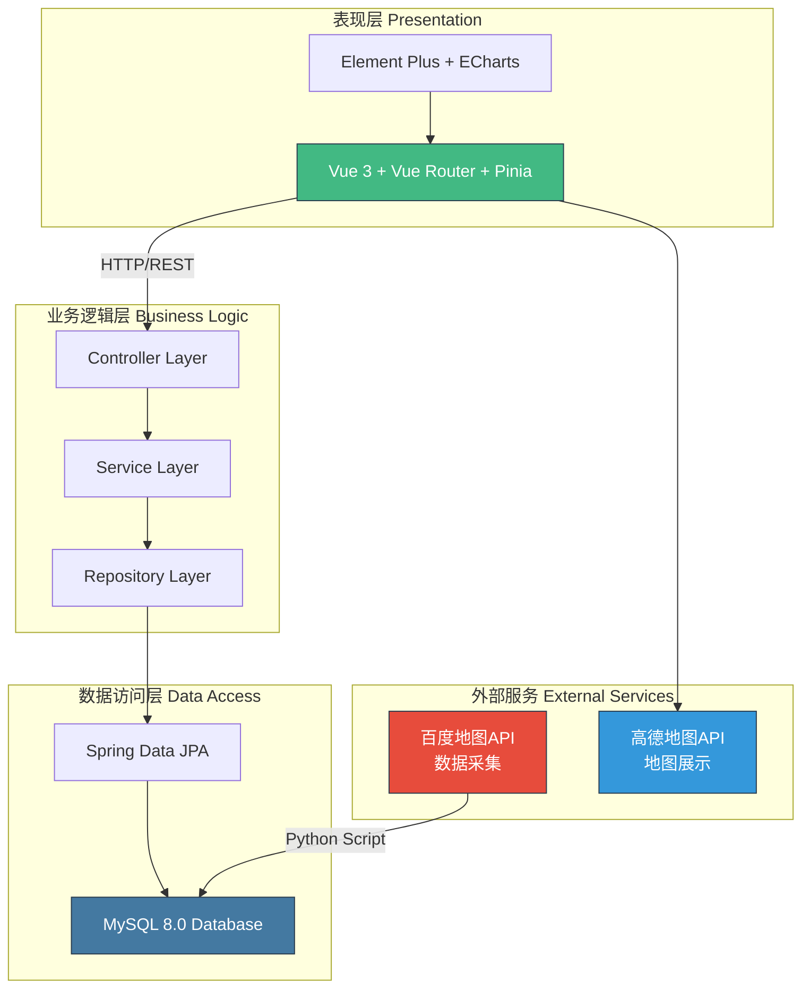
```mermaid
graph TB
    subgraph "表现层 Presentation"
        Vue[Vue 3 + Vue Router + Pinia]
        Element[Element Plus + ECharts]
    end

    subgraph "业务逻辑层 Business Logic"
        Controller[Controller Layer]
        Service[Service Layer]
        Repository[Repository Layer]
    end

    subgraph "数据访问层 Data Access"
        JPA[Spring Data JPA]
        MySQL[MySQL 8.0 Database]
    end

    subgraph "外部服务 External Services"
        Baidu[百度地图API<br/>数据采集]
        AMap[高德地图API<br/>地图展示]
    end

    Vue -->|HTTP/REST| Controller
    Element --> Vue
    Controller --> Service
    Service --> Repository
    Repository --> JPA
    JPA --> MySQL
    Baidu -->|Python Script| MySQL
    Vue --> AMap

    style Vue fill:#42b983,stroke:#2c3e50,color:#fff
    style MySQL fill:#4479A1,stroke:#2c3e50,color:#fff
    style Baidu fill:#E74C3C,stroke:#2c3e50,color:#fff
    style AMap fill:#3498DB,stroke:#2c3e50,color:#fff
```

### 1.2 前端架构

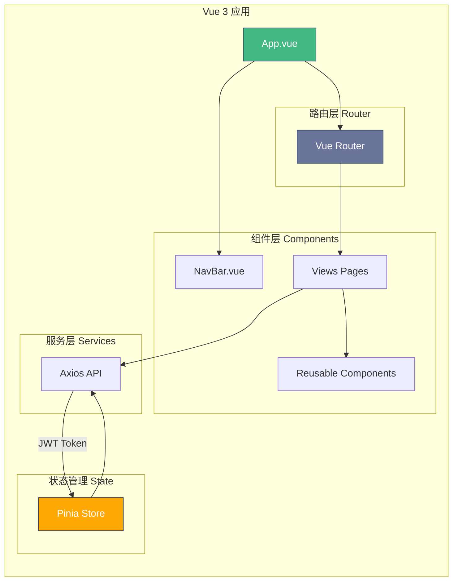
```mermaid
graph LR
    subgraph "Vue 3 应用"
        App[App.vue]

        subgraph "组件层 Components"
            NavBar[NavBar.vue]
            Views[Views Pages]
            Components[Reusable Components]
        end

        subgraph "状态管理 State"
            Pinia[Pinia Store]
        end

        subgraph "路由层 Router"
            Router[Vue Router]
        end

        subgraph "服务层 Services"
            API[Axios API]
        end
    end

    App --> NavBar
    App --> Router
    Router --> Views
    Views --> Components
    Views --> API
    API -->|JWT Token| Pinia
    Pinia --> API

    style App fill:#42b983,stroke:#2c3e50,color:#fff
    style Pinia fill:#fda805,stroke:#2c3e50,color:#fff
    style Router fill:#6b759c,stroke:#2c3e50,color:#fff
```

### 1.3 后端架构

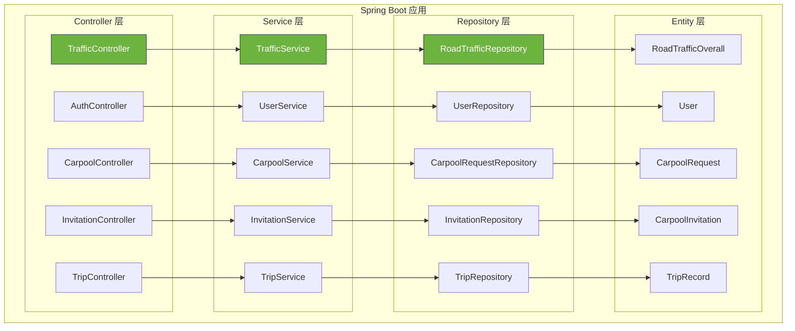
```mermaid
graph TB
    subgraph "Spring Boot 应用"
        subgraph "Controller 层"
            TrafficCtrl[TrafficController]
            AuthCtrl[AuthController]
            CarpoolCtrl[CarpoolController]
            InvitationCtrl[InvitationController]
            TripCtrl[TripController]
        end

        subgraph "Service 层"
            TrafficSvc[TrafficService]
            UserSvc[UserService]
            CarpoolSvc[CarpoolService]
            InvitationSvc[InvitationService]
            TripSvc[TripService]
        end

        subgraph "Repository 层"
            TrafficRepo[RoadTrafficRepository]
            UserRepo[UserRepository]
            CarpoolRepo[CarpoolRequestRepository]
            InvitationRepo[InvitationRepository]
            TripRepo[TripRepository]
        end

        subgraph "Entity 层"
            TrafficEnt[RoadTrafficOverall]
            UserEnt[User]
            CarpoolEnt[CarpoolRequest]
            InvitationEnt[CarpoolInvitation]
            TripEnt[TripRecord]
        end
    end

    TrafficCtrl --> TrafficSvc
    AuthCtrl --> UserSvc
    CarpoolCtrl --> CarpoolSvc
    InvitationCtrl --> InvitationSvc
    TripCtrl --> TripSvc

    TrafficSvc --> TrafficRepo
    UserSvc --> UserRepo
    CarpoolSvc --> CarpoolRepo
    InvitationSvc --> InvitationRepo
    TripSvc --> TripRepo

    TrafficRepo --> TrafficEnt
    UserRepo --> UserEnt
    CarpoolRepo --> CarpoolEnt
    InvitationRepo --> InvitationEnt
    TripRepo --> TripEnt

    style TrafficCtrl fill:#6DB33F,stroke:#2c3e50,color:#fff
    style TrafficSvc fill:#6DB33F,stroke:#2c3e50,color:#fff
    style TrafficRepo fill:#6DB33F,stroke:#2c3e50,color:#fff
```

---

## 2. 数据库设计

### 2.1 完整ER图

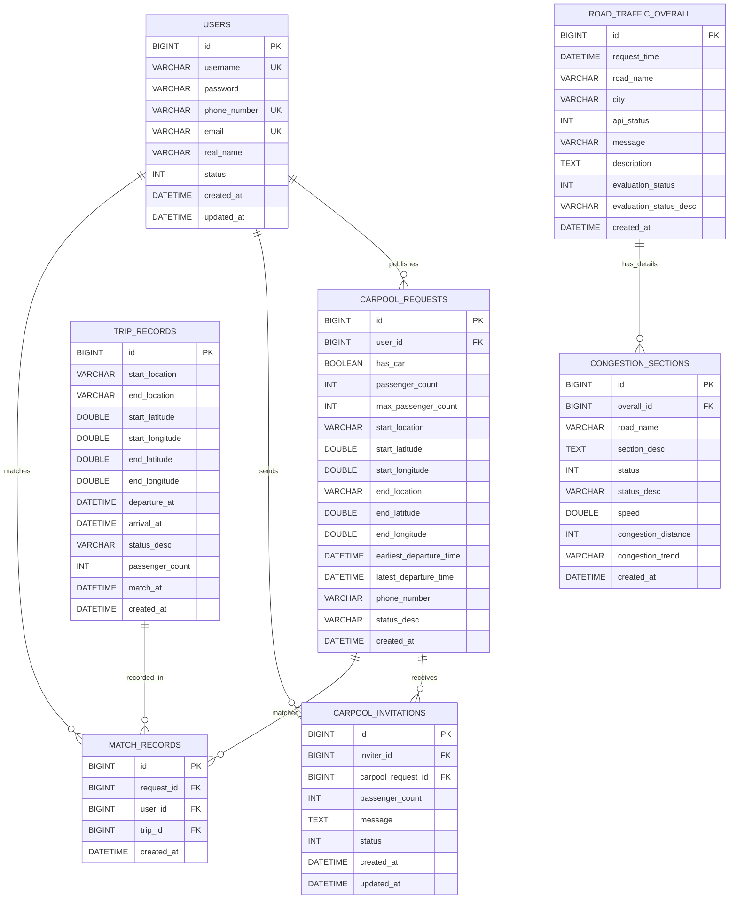
```mermaid
erDiagram
    USERS ||--o{ CARPOOL_REQUESTS : "publishes"
    USERS ||--o{ CARPOOL_INVITATIONS : "sends"
    USERS ||--o{ MATCH_RECORDS : "matches"
    CARPOOL_REQUESTS ||--o{ CARPOOL_INVITATIONS : "receives"
    CARPOOL_REQUESTS ||--o{ MATCH_RECORDS : "matched_in"
    TRIP_RECORDS ||--o{ MATCH_RECORDS : "recorded_in"
    ROAD_TRAFFIC_OVERALL ||--o{ CONGESTION_SECTIONS : "has_details"

    USERS {
        BIGINT id PK
        VARCHAR username UK
        VARCHAR password
        VARCHAR phone_number UK
        VARCHAR email UK
        VARCHAR real_name
        INT status
        DATETIME created_at
        DATETIME updated_at
    }

    CARPOOL_REQUESTS {
        BIGINT id PK
        BIGINT user_id FK
        BOOLEAN has_car
        INT passenger_count
        INT max_passenger_count
        VARCHAR start_location
        DOUBLE start_latitude
        DOUBLE start_longitude
        VARCHAR end_location
        DOUBLE end_latitude
        DOUBLE end_longitude
        DATETIME earliest_departure_time
        DATETIME latest_departure_time
        VARCHAR phone_number
        VARCHAR status_desc
        DATETIME created_at
    }

    CARPOOL_INVITATIONS {
        BIGINT id PK
        BIGINT inviter_id FK
        BIGINT carpool_request_id FK
        INT passenger_count
        TEXT message
        INT status
        DATETIME created_at
        DATETIME updated_at
    }

    TRIP_RECORDS {
        BIGINT id PK
        VARCHAR start_location
        VARCHAR end_location
        DOUBLE start_latitude
        DOUBLE start_longitude
        DOUBLE end_latitude
        DOUBLE end_longitude
        DATETIME departure_at
        DATETIME arrival_at
        VARCHAR status_desc
        INT passenger_count
        DATETIME match_at
        DATETIME created_at
    }

    MATCH_RECORDS {
        BIGINT id PK
        BIGINT request_id FK
        BIGINT user_id FK
        BIGINT trip_id FK
        DATETIME created_at
    }

    ROAD_TRAFFIC_OVERALL {
        BIGINT id PK
        DATETIME request_time
        VARCHAR road_name
        VARCHAR city
        INT api_status
        VARCHAR message
        TEXT description
        INT evaluation_status
        VARCHAR evaluation_status_desc
        DATETIME created_at
    }

    CONGESTION_SECTIONS {
        BIGINT id PK
        BIGINT overall_id FK
        VARCHAR road_name
        TEXT section_desc
        INT status
        VARCHAR status_desc
        DOUBLE speed
        INT congestion_distance
        VARCHAR congestion_trend
        DATETIME created_at
    }
```

### 2.2 用户与拼车关系图

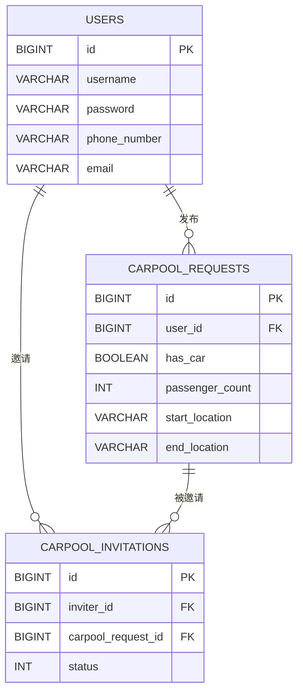
```mermaid
erDiagram
    USERS ||--o{ CARPOOL_REQUESTS : "发布"
    USERS ||--o{ CARPOOL_INVITATIONS : "邀请"
    CARPOOL_REQUESTS ||--o{ CARPOOL_INVITATIONS : "被邀请"

    USERS {
        BIGINT id PK
        VARCHAR username
        VARCHAR password
        VARCHAR phone_number
        VARCHAR email
    }

    CARPOOL_REQUESTS {
        BIGINT id PK
        BIGINT user_id FK
        BOOLEAN has_car
        INT passenger_count
        VARCHAR start_location
        VARCHAR end_location
    }

    CARPOOL_INVITATIONS {
        BIGINT id PK
        BIGINT inviter_id FK
        BIGINT carpool_request_id FK
        INT status
    }
```

### 2.3 路况数据关系图

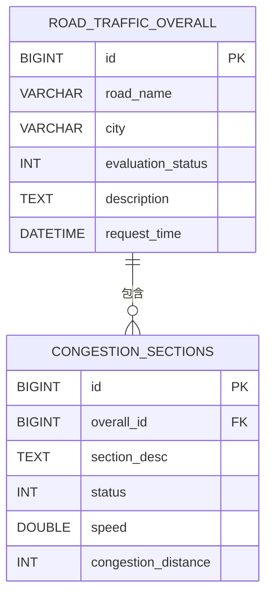
```mermaid
erDiagram
    ROAD_TRAFFIC_OVERALL ||--o{ CONGESTION_SECTIONS : "包含"

    ROAD_TRAFFIC_OVERALL {
        BIGINT id PK
        VARCHAR road_name
        VARCHAR city
        INT evaluation_status
        TEXT description
        DATETIME request_time
    }

    CONGESTION_SECTIONS {
        BIGINT id PK
        BIGINT overall_id FK
        TEXT section_desc
        INT status
        DOUBLE speed
        INT congestion_distance
    }
```

---

## 3. 业务流程图

### 3.1 用户登录认证流程

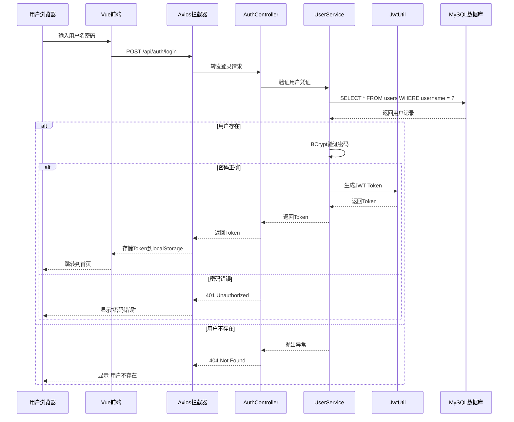
```mermaid
sequenceDiagram
    participant U as 用户浏览器
    participant F as Vue前端
    participant A as Axios拦截器
    participant C as AuthController
    participant S as UserService
    participant J as JwtUtil
    participant DB as MySQL数据库

    U->>F: 输入用户名密码
    F->>A: POST /api/auth/login
    A->>C: 转发登录请求
    C->>S: 验证用户凭证

    S->>DB: SELECT * FROM users WHERE username = ?
    DB-->>S: 返回用户记录

    alt 用户存在
        S->>S: BCrypt验证密码
        alt 密码正确
            S->>J: 生成JWT Token
            J-->>S: 返回Token
            S-->>C: 返回Token
            C-->>A: 返回Token
            A-->>F: 存储Token到localStorage
            F-->>U: 跳转到首页
        else 密码错误
            C-->>A: 401 Unauthorized
            A-->>U: 显示"密码错误"
        end
    else 用户不存在
        S-->>C: 抛出异常
        C-->>A: 404 Not Found
        A-->>U: 显示"用户不存在"
    end
```

### 3.2 受保护资源访问流程

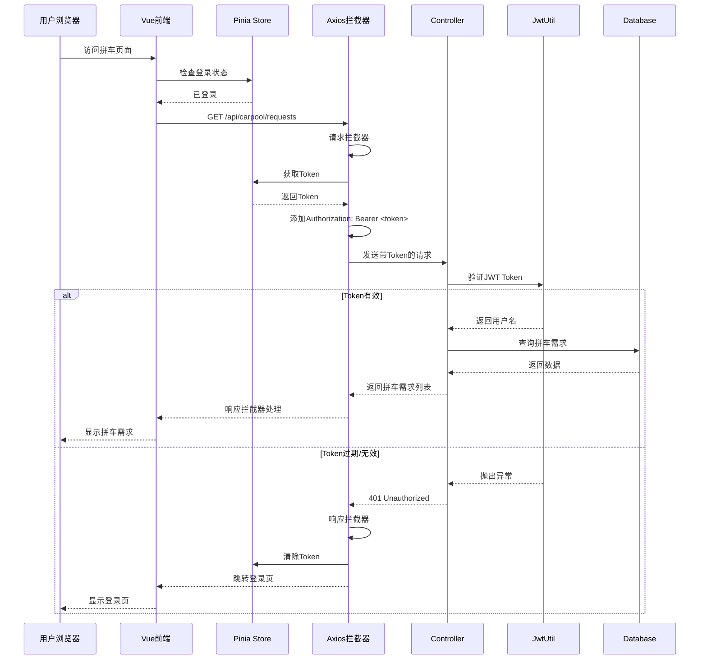
```mermaid
sequenceDiagram
    participant U as 用户浏览器
    participant F as Vue前端
    participant S as Pinia Store
    participant A as Axios拦截器
    participant C as Controller
    participant V as JwtUtil
    participant DB as Database

    U->>F: 访问拼车页面
    F->>S: 检查登录状态
    S-->>F: 已登录

    F->>A: GET /api/carpool/requests
    A->>A: 请求拦截器
    A->>S: 获取Token
    S-->>A: 返回Token
    A->>A: 添加Authorization: Bearer <token>
    A->>C: 发送带Token的请求

    C->>V: 验证JWT Token
    alt Token有效
        V-->>C: 返回用户名
        C->>DB: 查询拼车需求
        DB-->>C: 返回数据
        C-->>A: 返回拼车需求列表
        A-->>F: 响应拦截器处理
        F-->>U: 显示拼车需求
    else Token过期/无效
        V-->>C: 抛出异常
        C-->>A: 401 Unauthorized
        A->>A: 响应拦截器
        A->>S: 清除Token
        A-->>F: 跳转登录页
        F-->>U: 显示登录页
    end
```

### 3.3 拼车完整流程

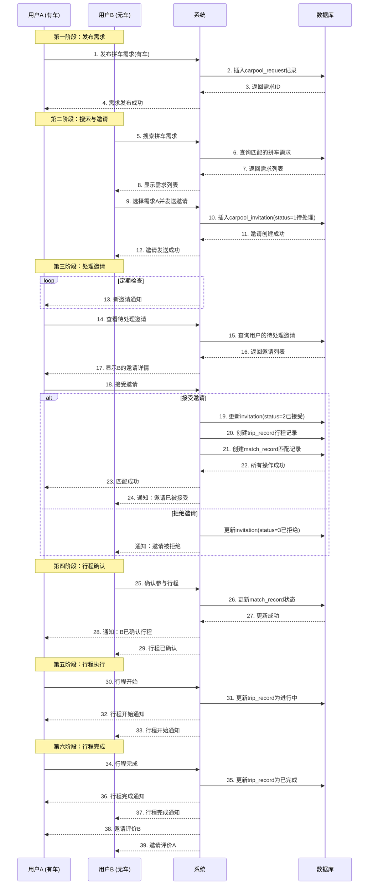
```mermaid
sequenceDiagram
    participant A as 用户A (有车)
    participant B as 用户B (无车)
    participant S as 系统
    participant DB as 数据库

    Note over A,B: 第一阶段：发布需求
    
    A->>S: 1. 发布拼车需求(有车)
    S->>DB: 2. 插入carpool_request记录
    DB-->>S: 3. 返回需求ID
    S-->>A: 4. 需求发布成功

    Note over A,B: 第二阶段：搜索与邀请
    
    B->>S: 5. 搜索拼车需求
    S->>DB: 6. 查询匹配的拼车需求
    DB-->>S: 7. 返回需求列表
    S-->>B: 8. 显示需求列表
    B->>S: 9. 选择需求A并发送邀请
    S->>DB: 10. 插入carpool_invitation(status=1待处理)
    DB-->>S: 11. 邀请创建成功
    S-->>B: 12. 邀请发送成功

    Note over A,B: 第三阶段：处理邀请
    
    loop 定期检查
        S-->>A: 13. 新邀请通知
    end
    
    A->>S: 14. 查看待处理邀请
    S->>DB: 15. 查询用户的待处理邀请
    DB-->>S: 16. 返回邀请列表
    S-->>A: 17. 显示B的邀请详情
    A->>S: 18. 接受邀请
    alt 接受邀请
        S->>DB: 19. 更新invitation(status=2已接受)
        S->>DB: 20. 创建trip_record行程记录
        S->>DB: 21. 创建match_record匹配记录
        DB-->>S: 22. 所有操作成功
        S-->>A: 23. 匹配成功
        S-->>B: 24. 通知：邀请已被接受
    else 拒绝邀请
        S->>DB: 更新invitation(status=3已拒绝)
        S-->>B: 通知：邀请被拒绝
    end

    Note over A,B: 第四阶段：行程确认
    
    B->>S: 25. 确认参与行程
    S->>DB: 26. 更新match_record状态
    DB-->>S: 27. 更新成功
    S-->>A: 28. 通知：B已确认行程
    S-->>B: 29. 行程已确认

    Note over A,B: 第五阶段：行程执行
    
    A->>S: 30. 行程开始
    S->>DB: 31. 更新trip_record为进行中
    S-->>A: 32. 行程开始通知
    S-->>B: 33. 行程开始通知

    Note over A,B: 第六阶段：行程完成
    
    A->>S: 34. 行程完成
    S->>DB: 35. 更新trip_record为已完成
    S-->>A: 36. 行程完成通知
    S-->>B: 37. 行程完成通知
    S-->>A: 38. 邀请评价B
    S-->>B: 39. 邀请评价A
```

### 3.4 路况数据采集流程

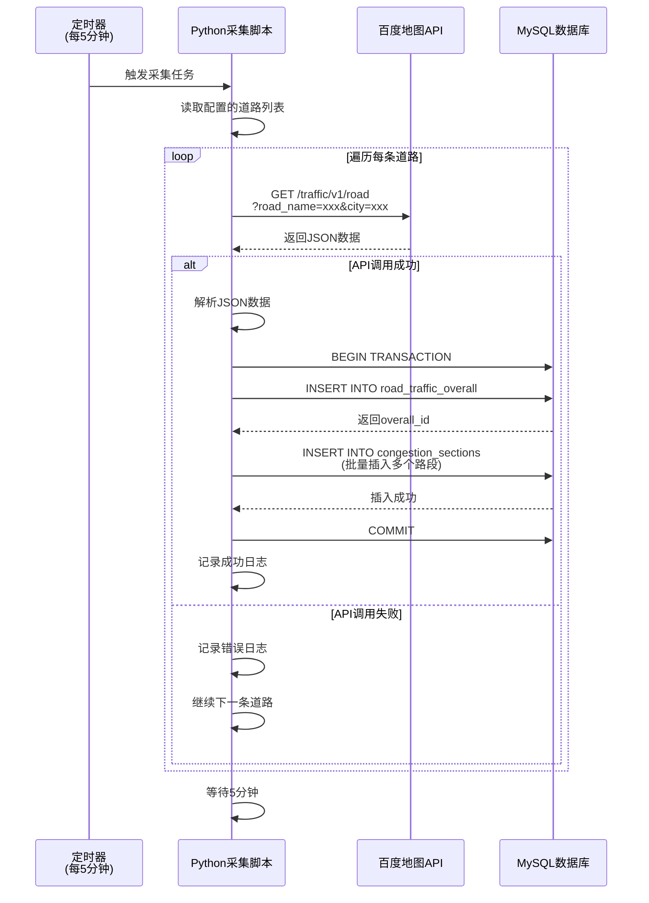
```mermaid
sequenceDiagram
    participant T as 定时器<br/>(每5分钟)
    participant P as Python采集脚本
    participant B as 百度地图API
    participant DB as MySQL数据库

    T->>P: 触发采集任务
    P->>P: 读取配置的道路列表

    loop 遍历每条道路
        P->>B: GET /traffic/v1/road<br/>?road_name=xxx&city=xxx
        B-->>P: 返回JSON数据

        alt API调用成功
            P->>P: 解析JSON数据
            P->>DB: BEGIN TRANSACTION
            P->>DB: INSERT INTO road_traffic_overall
            DB-->>P: 返回overall_id
            P->>DB: INSERT INTO congestion_sections<br/>(批量插入多个路段)
            DB-->>P: 插入成功
            P->>DB: COMMIT
            P->>P: 记录成功日志
        else API调用失败
            P->>P: 记录错误日志
            P->>P: 继续下一条道路
        end
    end

    P->>P: 等待5分钟
```

### 3.5 历史路况查询流程

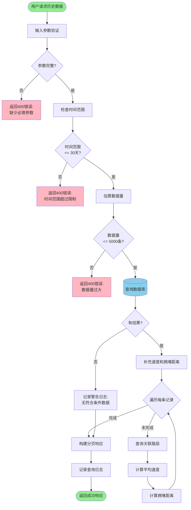
```mermaid
flowchart TD
    Start([用户请求历史数据]) --> ValidateInput[输入参数验证]
    ValidateInput --> CheckParams{参数完整?}

    CheckParams -->|否| ReturnError1[返回400错误:<br/>缺少必填参数]
    CheckParams -->|是| CheckTimeRange[检查时间范围]

    CheckTimeRange --> ValidateTime{时间范围<br/><= 30天?}

    ValidateTime -->|否| ReturnError2[返回400错误:<br/>时间范围超过限制]
    ValidateTime -->|是| CheckDataVolume[估算数据量]

    CheckDataVolume --> ValidateVolume{数据量<br//><= 5000条?}

    ValidateVolume -->|否| ReturnError3[返回400错误:<br/>数据量过大]
    ValidateVolume -->|是| QueryDB[(查询数据库)]

    QueryDB --> CheckResults{有结果?}

    CheckResults -->|否| LogWarning[记录警告日志:<br/>无符合条件数据]
    CheckResults -->|是| EnrichData[补充速度和拥堵距离]

    EnrichData --> LoopSections{遍历每条记录}
    LoopSections -->|未完成| QuerySections[查询关联路段]
    QuerySections --> CalcSpeed[计算平均速度]
    CalcSpeed --> CalcDist[计算拥堵距离]
    CalcDist --> LoopSections
    LoopSections -->|完成| BuildResponse[构建分页响应]

    LogWarning --> BuildResponse
    BuildResponse --> LogSuccess[记录查询日志]
    LogSuccess --> ReturnSuccess([返回成功响应])

    style Start fill:#90EE90
    style ReturnError1 fill:#FFB6C1
    style ReturnError2 fill:#FFB6C1
    style ReturnError3 fill:#FFB6C1
    style ReturnSuccess fill:#90EE90
    style QueryDB fill:#87CEEB
```

---

## 4. 组件交互图

### 4.1 前端组件层次结构

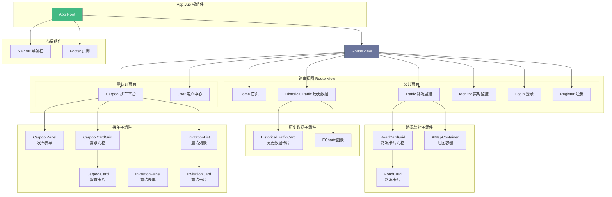
```mermaid
graph TB
    subgraph "App.vue 根组件"
        AppRoot[App Root]
    end

    subgraph "布局组件"
        NavBar[NavBar 导航栏]
        Footer[Footer 页脚]
    end

    subgraph "路由视图 RouterView"
        subgraph "公共页面"
            Home[Home 首页]
            Traffic[Traffic 路况监控]
            Historical[HistoricalTraffic 历史数据]
            Monitor[Monitor 实时监控]
            Login[Login 登录]
            Register[Register 注册]
        end

        subgraph "需认证页面"
            Carpool[Carpool 拼车平台]
            User[User 用户中心]
        end
    end

    subgraph "路况监控子组件"
        RoadCardGrid[RoadCardGrid<br/>路况卡片网格]
        RoadCard[RoadCard<br/>路况卡片]
        AMapContainer[AMapContainer<br/>地图容器]
    end

    subgraph "历史数据子组件"
        HistoricalCard[HistoricalTrafficCard<br/>历史数据卡片]
        Chart[ECharts图表]
    end

    subgraph "拼车子组件"
        CarpoolPanel[CarpoolPanel<br/>发布表单]
        CarpoolCardGrid[CarpoolCardGrid<br/>需求网格]
        CarpoolCard[CarpoolCard<br/>需求卡片]
        InvitationPanel[InvitationPanel<br/>邀请表单]
        InvitationList[InvitationList<br/>邀请列表]
        InvitationCard[InvitationCard<br/>邀请卡片]
    end

    AppRoot --> NavBar
    AppRoot --> RouterView
    AppRoot --> Footer

    RouterView --> Home
    RouterView --> Traffic
    RouterView --> Historical
    RouterView --> Monitor
    RouterView --> Carpool
    RouterView --> User
    RouterView --> Login
    RouterView --> Register

    Traffic --> RoadCardGrid
    Traffic --> AMapContainer
    RoadCardGrid --> RoadCard

    Historical --> HistoricalCard
    Historical --> Chart

    Carpool --> CarpoolPanel
    Carpool --> CarpoolCardGrid
    Carpool --> InvitationList
    CarpoolCardGrid --> CarpoolCard
    InvitationList --> InvitationCard

    style AppRoot fill:#42b983,stroke:#2c3e50,color:#fff
    style RouterView fill:#6b759c,stroke:#2c3e50,color:#fff
```

### 4.2 组件数据流

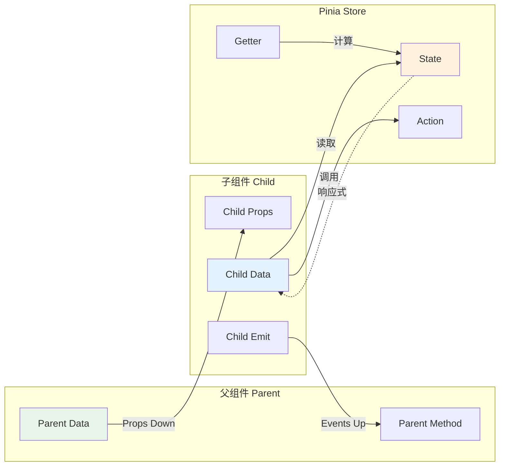
```mermaid
graph LR
    subgraph "父组件 Parent"
        ParentData[Parent Data]
        ParentMethod[Parent Method]
    end

    subgraph "子组件 Child"
        ChildProps[Child Props]
        ChildData[Child Data]
        ChildEmit[Child Emit]
    end

    subgraph "Pinia Store"
        StoreState[State]
        StoreAction[Action]
        StoreGetter[Getter]
    end

    ParentData -->|Props Down| ChildProps
    ChildEmit -->|Events Up| ParentMethod

    ChildData -->|读取| StoreState
    ChildData -->|调用| StoreAction
    StoreGetter -->|计算| StoreState
    StoreState -.->|响应式| ChildData

    style ParentData fill:#E8F5E9
    style ChildData fill:#E3F2FD
    style StoreState fill:#FFF3E0
```

---

## 5. 状态机图

### 5.1 拼车邀请状态机

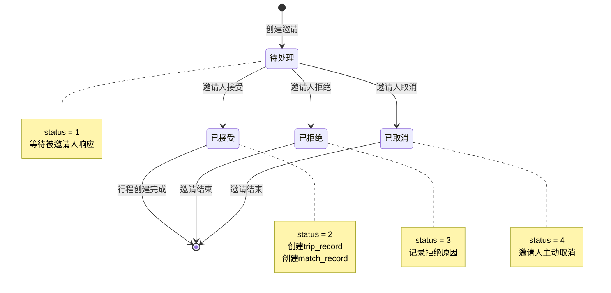
```mermaid
stateDiagram-v2
    [*] --> 待处理: 创建邀请

    待处理 --> 已接受: 邀请人接受
    待处理 --> 已拒绝: 邀请人拒绝
    待处理 --> 已取消: 邀请人取消

    已接受 --> [*]: 行程创建完成
    已拒绝 --> [*]: 邀请结束
    已取消 --> [*]: 邀请结束

    note right of 待处理
        status = 1
        等待被邀请人响应
    end note

    note right of 已接受
        status = 2
        创建trip_record
        创建match_record
    end note

    note right of 已拒绝
        status = 3
        记录拒绝原因
    end note

    note right of 已取消
        status = 4
        邀请人主动取消
    end note
```

### 5.2 拼车需求状态机

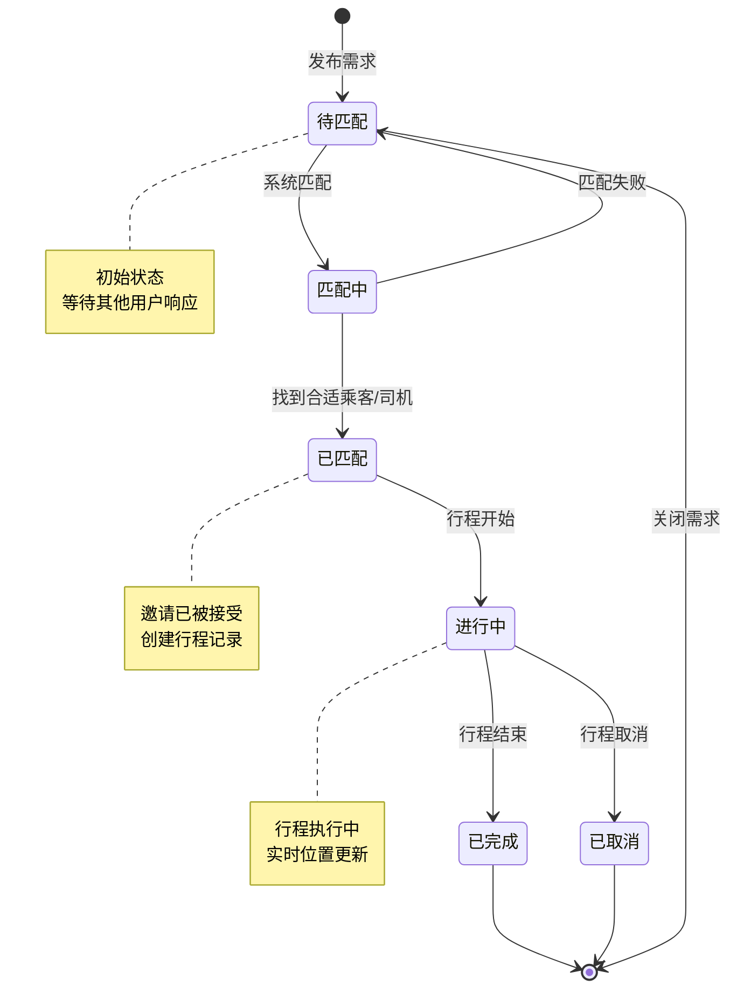
```mermaid
stateDiagram-v2
    [*] --> 待匹配: 发布需求

    待匹配 --> 匹配中: 系统匹配
    匹配中 --> 已匹配: 找到合适乘客/司机
    匹配中 --> 待匹配: 匹配失败

    已匹配 --> 进行中: 行程开始
    进行中 --> 已完成: 行程结束
    进行中 --> 已取消: 行程取消

    已完成 --> [*]
    已取消 --> [*]
    待匹配 --> [*]: 关闭需求

    note right of 待匹配
        初始状态
        等待其他用户响应
    end note

    note right of 已匹配
        邀请已被接受
        创建行程记录
    end note

    note right of 进行中
        行程执行中
        实时位置更新
    end note
```

### 5.3 路况状态机

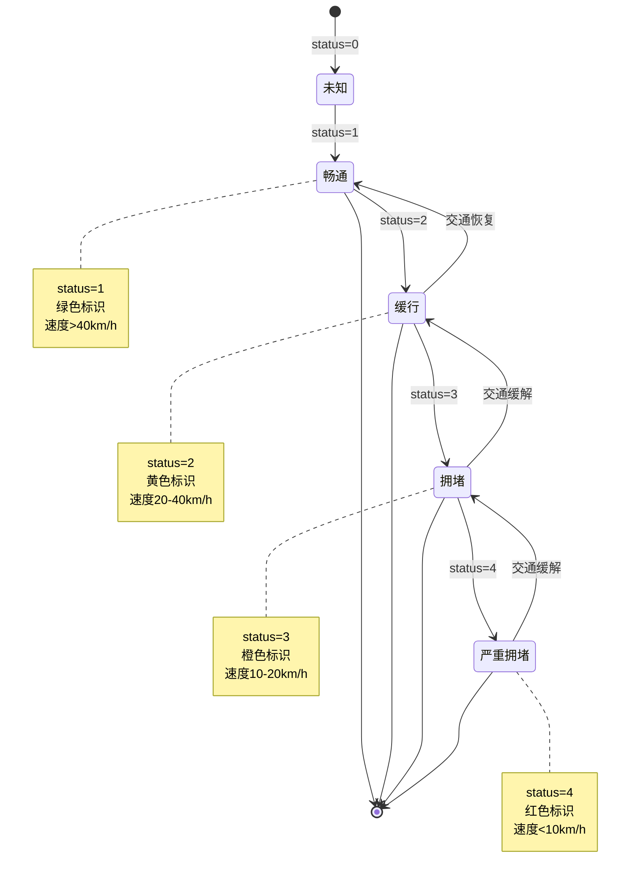
```mermaid
stateDiagram-v2
    [*] --> 未知: status=0

    未知 --> 畅通: status=1
    畅通 --> 缓行: status=2
    缓行 --> 拥堵: status=3
    拥堵 --> 严重拥堵: status=4

    严重拥堵 --> 拥堵: 交通缓解
    拥堵 --> 缓行: 交通缓解
    缓行 --> 畅通: 交通恢复

    畅通 --> [*]
    缓行 --> [*]
    拥堵 --> [*]
    严重拥堵 --> [*]

    note right of 畅通
        status=1
        绿色标识
        速度>40km/h
    end note

    note right of 缓行
        status=2
        黄色标识
        速度20-40km/h
    end note

    note right of 拥堵
        status=3
        橙色标识
        速度10-20km/h
    end note

    note right of 严重拥堵
        status=4
        红色标识
        速度<10km/h
    end note
```

---

## 6. 时序图

### 6.1 注册流程时序图

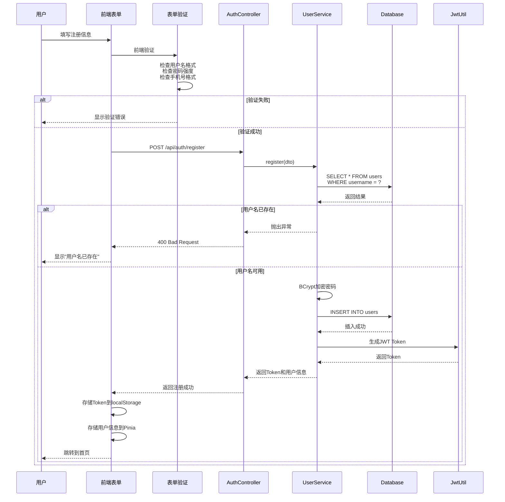
```mermaid
sequenceDiagram
    participant U as 用户
    participant F as 前端表单
    participant V as 表单验证
    participant C as AuthController
    participant S as UserService
    participant DB as Database
    participant J as JwtUtil

    U->>F: 填写注册信息
    F->>V: 前端验证
    V->>V: 检查用户名格式<br/>检查密码强度<br/>检查手机号格式

    alt 验证失败
        V-->>U: 显示验证错误
    else 验证成功
        F->>C: POST /api/auth/register
        C->>S: register(dto)

        S->>DB: SELECT * FROM users<br/>WHERE username = ?
        DB-->>S: 返回结果

        alt 用户名已存在
            S-->>C: 抛出异常
            C-->>F: 400 Bad Request
            F-->>U: 显示"用户名已存在"
        else 用户名可用
            S->>S: BCrypt加密密码
            S->>DB: INSERT INTO users
            DB-->>S: 插入成功
            S->>J: 生成JWT Token
            J-->>S: 返回Token
            S-->>C: 返回Token和用户信息
            C-->>F: 返回注册成功
            F->>F: 存储Token到localStorage
            F->>F: 存储用户信息到Pinia
            F-->>U: 跳转到首页
        end
    end
```

### 6.2 路况查询优化流程

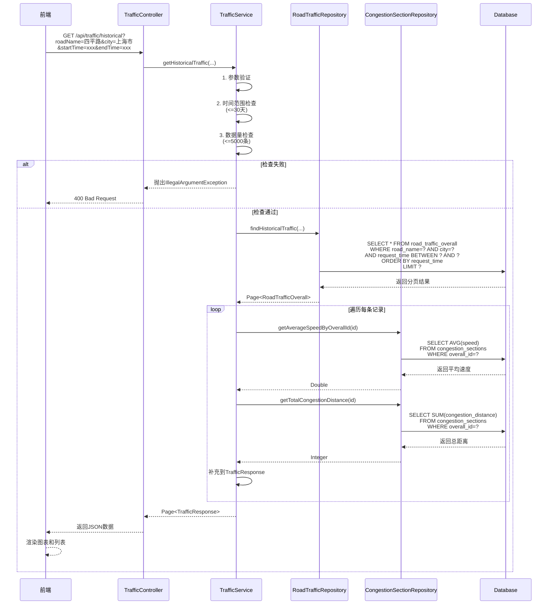
```mermaid
sequenceDiagram
    participant F as 前端
    participant C as TrafficController
    participant S as TrafficService
    participant R as RoadTrafficRepository
    participant CS as CongestionSectionRepository
    participant DB as Database

    F->>C: GET /api/traffic/historical?<br/>roadName=四平路&city=上海市<br/>&startTime=xxx&endTime=xxx
    C->>S: getHistoricalTraffic(...)

    S->>S: 1. 参数验证
    S->>S: 2. 时间范围检查<br/>(<=30天)
    S->>S: 3. 数据量检查<br/>(<=5000条)

    alt 检查失败
        S-->>C: 抛出IllegalArgumentException
        C-->>F: 400 Bad Request
    else 检查通过
        S->>R: findHistoricalTraffic(...)
        R->>DB: SELECT * FROM road_traffic_overall<br/>WHERE road_name=? AND city=?<br/>AND request_time BETWEEN ? AND ?<br/>ORDER BY request_time<br/>LIMIT ?
        DB-->>R: 返回分页结果
        R-->>S: Page<RoadTrafficOverall>

        loop 遍历每条记录
            S->>CS: getAverageSpeedByOverallId(id)
            CS->>DB: SELECT AVG(speed)<br/>FROM congestion_sections<br/>WHERE overall_id=?
            DB-->>CS: 返回平均速度
            CS-->>S: Double

            S->>CS: getTotalCongestionDistance(id)
            CS->>DB: SELECT SUM(congestion_distance)<br/>FROM congestion_sections<br/>WHERE overall_id=?
            DB-->>CS: 返回总距离
            CS-->>S: Integer

            S->>S: 补充到TrafficResponse
        end

        S-->>C: Page<TrafficResponse>
        C-->>F: 返回JSON数据
        F-->>F: 渲染图表和列表
    end
```

---

## 7. 部署架构图

### 7.1 生产环境部署架构

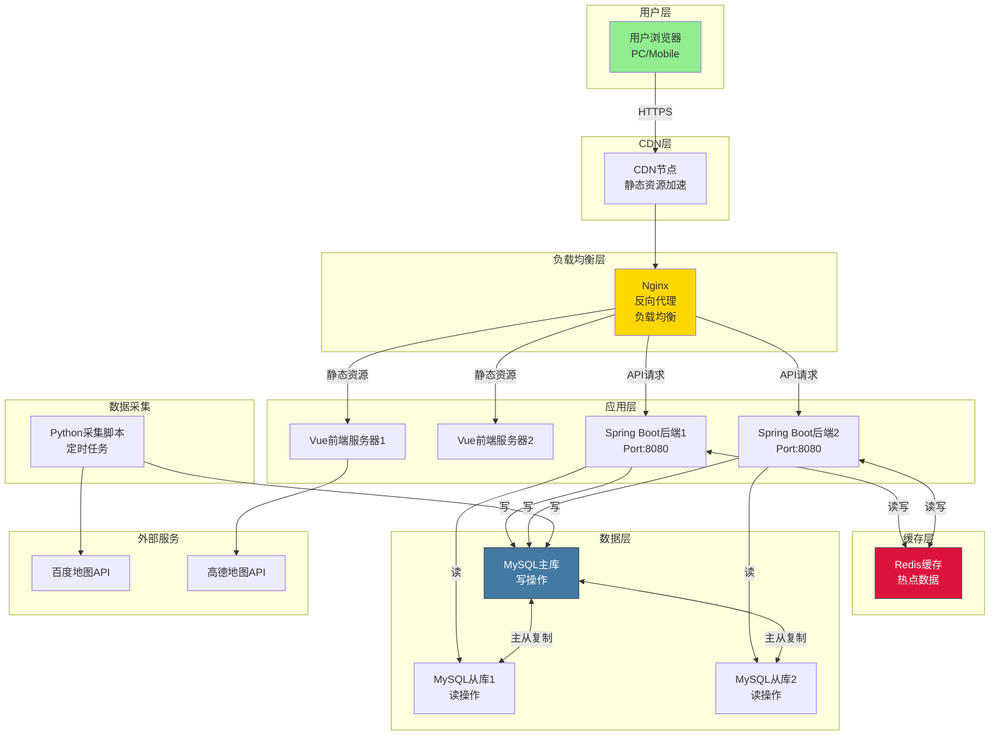
```mermaid
graph TB
    subgraph "用户层"
        User[用户浏览器<br/>PC/Mobile]
    end

    subgraph "CDN层"
        CDN[CDN节点<br/>静态资源加速]
    end

    subgraph "负载均衡层"
        LB[Nginx<br/>反向代理<br/>负载均衡]
    end

    subgraph "应用层"
        FE1[Vue前端服务器1]
        FE2[Vue前端服务器2]
        BE1[Spring Boot后端1<br/>Port:8080]
        BE2[Spring Boot后端2<br/>Port:8080]
    end

    subgraph "缓存层"
        Redis[Redis缓存<br/>热点数据]
    end

    subgraph "数据层"
        MySQL_Master[MySQL主库<br/>写操作]
        MySQL_Slave1[MySQL从库1<br/>读操作]
        MySQL_Slave2[MySQL从库2<br/>读操作]
    end

    subgraph "外部服务"
        BaiduAPI[百度地图API]
        AMapAPI[高德地图API]
    end

    subgraph "数据采集"
        Collector[Python采集脚本<br/>定时任务]
    end

    User -->|HTTPS| CDN
    CDN --> LB
    LB -->|静态资源| FE1
    LB -->|静态资源| FE2
    LB -->|API请求| BE1
    LB -->|API请求| BE2

    BE1 <-->|读写| Redis
    BE2 <-->|读写| Redis
    BE1 -->|写| MySQL_Master
    BE2 -->|写| MySQL_Master
    BE1 -->|读| MySQL_Slave1
    BE2 -->|读| MySQL_Slave2
    MySQL_Master <-->|主从复制| MySQL_Slave1
    MySQL_Master <-->|主从复制| MySQL_Slave2

    FE1 --> AMapAPI
    Collector --> BaiduAPI
    Collector -->|写| MySQL_Master

    style User fill:#90EE90
    style LB fill:#FFD700
    style Redis fill:#DC143C,stroke:#2c3e50,color:#fff
    style MySQL_Master fill:#4479A1,stroke:#2c3e50,color:#fff
```

### 7.2 开发环境架构

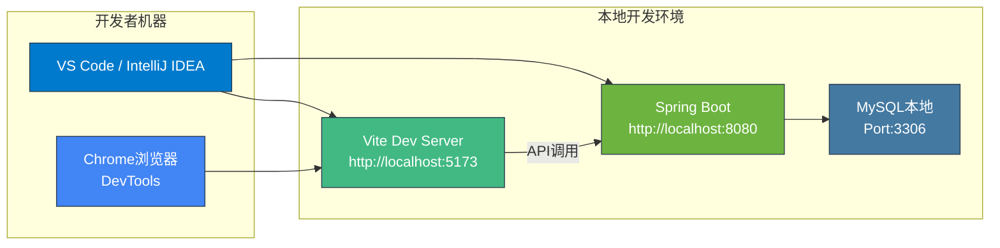
```mermaid
graph LR
    subgraph "开发者机器"
        IDE[VS Code / IntelliJ IDEA]
        Browser[Chrome浏览器<br/>DevTools]
    end

    subgraph "本地开发环境"
        Vite[Vite Dev Server<br/>http://localhost:5173]
        SpringBoot[Spring Boot<br/>http://localhost:8080]
        MySQL[MySQL本地<br/>Port:3306]
    end

    IDE --> Vite
    IDE --> SpringBoot
    Browser --> Vite
    Vite -->|API调用| SpringBoot
    SpringBoot --> MySQL

    style IDE fill:#007ACC,stroke:#2c3e50,color:#fff
    style Browser fill:#4285F4,stroke:#2c3e50,color:#fff
    style Vite fill:#42b983,stroke:#2c3e50,color:#fff
    style SpringBoot fill:#6DB33F,stroke:#2c3e50,color:#fff
    style MySQL fill:#4479A1,stroke:#2c3e50,color:#fff
```

---

## 8. 数据流图

### 8.1 路况数据流

```mermaid
graph LR
    subgraph "数据源"
        Baidu[百度地图API]
    end

    subgraph "数据采集"
        Python[Python脚本<br/>定时执行]
    end

    subgraph "数据存储"
        Overall[(road_traffic_overall)]
        Sections[(congestion_sections)]
    end

    subgraph "数据查询"
        Repository[Repository Layer]
        Service[Service Layer]
    end

    subgraph "数据展示"
        API[REST API]
        Vue[Vue前端]
        Chart[ECharts图表]
        Map[高德地图]
    end

    Baidu -->|HTTP API| Python
    Python -->|INSERT| Overall
    Python -->|INSERT| Sections

    Overall -->|SELECT| Repository
    Sections -->|SELECT| Repository
    Repository --> Service
    Service --> API
    API --> Vue
    Vue --> Chart
    Vue --> Map

    style Baidu fill:#E74C3C,stroke:#2c3e50,color:#fff
    style Overall fill:#4479A1,stroke:#2c3e50,color:#fff
    style Sections fill:#4479A1,stroke:#2c3e50,color:#fff
    style Vue fill:#42b983,stroke:#2c3e50,color:#fff
```

### 8.2 用户认证数据流

```mermaid
graph TB
    subgraph "用户"
        User[用户操作]
    end

    subgraph "前端"
        Form[登录表单]
        Pinia[Pinia Store<br/>存储Token]
        LocalStorage[localStorage<br/>持久化]
    end

    subgraph "API层"
        Axios[Axios拦截器]
        Request[HTTP Request<br/>Authorization Header]
    end

    subgraph "后端"
        JWT[JWT验证]
        Controller[Controller]
        Service[Service]
    end

    subgraph "数据库"
        Users[(users表)]
    end

    User --> Form
    Form --> Axios
    Axios --> Request
    Request --> Controller
    Controller --> JWT
    JWT -->|验证通过| Service
    Service --> Users

    Service -->|生成Token| JWT
    JWT --> Request
    Request --> Axios
    Axios --> Pinia
    Pinia --> LocalStorage

    LocalStorage -.->|持久化| Pinia
    Pinia -.->|自动添加| Axios

    style User fill:#90EE90
    style Pinia fill:#fda805,stroke:#2c3e50,color:#fff
    style JWT fill:#E74C3C,stroke:#2c3e50,color:#fff
    style Users fill:#4479A1,stroke:#2c3e50,color:#fff
```

---

## 9. 类图

### 9.1 后端核心类图

```mermaid
classDiagram
    class TrafficController {
        +getAllTraffic(Pageable) Page~TrafficResponse~
        +getTrafficByCity(String, Pageable) Page~TrafficResponse~
        +getHistoricalTraffic(...) Page~TrafficResponse~
        +getTrafficStats() TrafficStatsResponse
    }

    class TrafficService {
        -RoadTrafficRepository repository
        -CongestionSectionRepository sectionRepository
        +getAllLatestTraffic(Pageable) Page~TrafficResponse~
        +getHistoricalTraffic(...) Page~TrafficResponse~
        +getTrafficStats() TrafficStatsResponse
        -validateHistoricalQueryParams(...) void
        -convertToTrafficResponse(RoadTrafficOverall) TrafficResponse
    }

    class RoadTrafficRepository {
        <<interface>>
        +findLatestForEachRoad(Pageable) Page~RoadTrafficOverall~
        +findHistoricalTraffic(...) Page~RoadTrafficOverall~
        +getTrafficStatsSince(LocalDateTime) List~Object[]~
    }

    class RoadTrafficOverall {
        -Long id
        -String roadName
        -String city
        -Integer evaluationStatus
        -String description
        -LocalDateTime requestTime
        +@PrePersist onCreate()
    }

    class TrafficResponse {
        -Long id
        -String roadName
        -String city
        -Integer evaluationStatus
        -Double speed
        -Integer congestionDistance
    }

    class TrafficStatsResponse {
        -Long total
        -Long smooth
        -Long slow
        -Long congested
        -Long heavy
    }

    TrafficController --> TrafficService : uses
    TrafficService --> RoadTrafficRepository : uses
    TrafficService --> TrafficResponse : creates
    TrafficService --> TrafficStatsResponse : creates
    RoadTrafficRepository --> RoadTrafficOverall : manages
    TrafficResponse --> RoadTrafficOverall : maps from
```

### 9.2 拼车模块类图

```mermaid
classDiagram
    class CarpoolController {
        +createRequest(CarpoolRequestDto) CarpoolRequest
        +searchRequests(...) List~CarpoolRequestResponse~
    }

    class CarpoolService {
        -CarpoolRequestRepository requestRepository
        -UserRepository userRepository
        +createCarpoolRequest(CarpoolRequestDto) CarpoolRequest
        +searchRequestsWithUserInfo(...) List~CarpoolRequestResponse~
    }

    class InvitationService {
        -InvitationRepository invitationRepository
        +createInvitation(InvitationDto) CarpoolInvitation
        +acceptInvitation(Long) void
        +rejectInvitation(Long) void
    }

    class CarpoolRequest {
        -Long id
        -Long userId
        -Boolean hasCar
        -Integer passengerCount
        -String startLocation
        -String endLocation
        -LocalDateTime earliestDepartureTime
        +@PrePersist onCreate()
    }

    class CarpoolInvitation {
        -Long id
        -Long inviterId
        -Long carpoolRequestId
        -Integer status
        -String message
    }

    class TripRecord {
        -Long id
        -String startLocation
        -String endLocation
        -LocalDateTime departureAt
        -String statusDesc
    }

    class CarpoolRequestResponse {
        -Long id
        -String username
        -String realName
        -Boolean hasCar
        -String startLocation
    }

    CarpoolController --> CarpoolService : uses
    CarpoolController --> InvitationService : uses
    CarpoolService --> CarpoolRequest : manages
    InvitationService --> CarpoolInvitation : manages
    InvitationService --> TripRecord : creates
    CarpoolService --> CarpoolRequestResponse : creates
```

---

## 10. 甘特图

### 10.1 项目开发进度

```mermaid
gantt
    title 拼车与实时交通监控系统开发进度
    dateFormat  YYYY-MM-DD
    section 需求分析
    需求调研           :done, req1, 2024-11-01, 5d
    需求文档编写       :done, req2, 2024-11-06, 4d

    section 系统设计
    架构设计           :done, des1, 2024-11-10, 5d
    数据库设计         :done, des2, 2024-11-15, 4d
    API设计            :done, des3, 2024-11-19, 3d

    section 后端开发
    Spring Boot搭建    :done, be1, 2024-11-22, 3d
    用户模块开发       :done, be2, 2024-11-25, 5d
    路况模块开发       :done, be3, 2024-11-30, 7d
    拼车模块开发       :done, be4, 2024-12-07, 7d
    JWT认证实现        :done, be5, 2024-12-14, 3d

    section 前端开发
    Vue 3项目搭建      :done, fe1, 2024-11-22, 2d
    路况监控页面       :done, fe2, 2024-11-24, 6d
    历史数据页面       :done, fe3, 2024-12-02, 5d
    拼车平台页面       :done, fe4, 2024-12-09, 6d
    用户认证页面       :done, fe5, 2024-12-15, 3d

    section 数据采集
    Python脚本开发     :done, col1, 2024-12-01, 4d
    API集成测试        :done, col2, 2024-12-05, 3d

    section 测试与优化
    单元测试           :done, test1, 2024-12-18, 4d
    集成测试           :done, test2, 2024-12-22, 4d
    性能优化           :done, opt1, 2024-12-24, 3d
    Bug修复            :active, bug1, 2024-12-26, 2d

    section 部署上线
    文档编写           :active, doc1, 2024-12-26, 3d
    部署准备           :deploy1, 2024-12-29, 2d
```

---

## 11. 用例图

### 11.1 系统总体用例图

```mermaid
graph TB
    subgraph "用户角色"
        Guest[游客<br/>未登录用户]
        RegisteredUser[注册用户]
        Admin[系统管理员]
    end

    subgraph "路况监控模块"
        UC1[查看实时路况]
        UC2[搜索路况信息]
        UC3[查看路况统计]
        UC4[查看历史路况]
        UC5[查看地图展示]
    end

    subgraph "用户认证模块"
        UC6[用户注册]
        UC7[用户登录]
        UC8[查看个人信息]
        UC9[修改个人信息]
        UC10[退出登录]
    end

    subgraph "拼车模块"
        UC11[发布拼车需求]
        UC12[搜索拼车需求]
        UC13[发送拼车邀请]
        UC14[查看邀请列表]
        UC15[接受/拒绝邀请]
        UC16[查看行程记录]
        UC17[管理行程状态]
    end

    subgraph "管理模块"
        UC18[管理用户账号]
        UC19[查看系统日志]
        UC20[数据备份]
    end

    Guest --> UC1
    Guest --> UC2
    Guest --> UC3
    Guest --> UC4
    Guest --> UC5
    Guest --> UC6
    Guest --> UC7

    RegisteredUser --> UC1
    RegisteredUser --> UC2
    RegisteredUser --> UC3
    RegisteredUser --> UC4
    RegisteredUser --> UC5
    RegisteredUser --> UC7
    RegisteredUser --> UC8
    RegisteredUser --> UC9
    RegisteredUser --> UC10
    RegisteredUser --> UC11
    RegisteredUser --> UC12
    RegisteredUser --> UC13
    RegisteredUser --> UC14
    RegisteredUser --> UC15
    RegisteredUser --> UC16
    RegisteredUser --> UC17

    Admin --> UC18
    Admin --> UC19
    Admin --> UC20
    Admin --> UC1
    Admin --> UC3

    style Guest fill:#FFE4B5
    style RegisteredUser fill:#90EE90
    style Admin fill:#FF6B6B
    style UC1 fill:#87CEEB
    style UC11 fill:#87CEEB
    style UC18 fill:#DDA0DD
```

### 11.2 路况监控用例图

```mermaid
graph TB
    subgraph "参与者"
        User[普通用户]
        System[系统]
    end

    subgraph "路况查看"
        ViewRealTime[查看实时路况]
        ViewCity[按城市查看]
        ViewRoad[按道路查看]
        ViewStatus[按拥堵状态查看]
    end

    subgraph "路况搜索"
        Search[搜索路况]
        SearchByKeyword[关键词搜索]
        FilterCity[城市筛选]
        FilterStatus[状态筛选]
    end

    subgraph "历史数据"
        ViewHistorical[查看历史路况]
        SelectTimeRange[选择时间范围]
        SelectRoad[选择道路]
        ViewTrend[查看趋势图]
        ExportData[导出数据]
    end

    subgraph "统计分析"
        ViewStats[查看统计信息]
        ViewDistribution[查看状态分布]
        ViewPopular[查看热门道路]
    end

    subgraph "地图功能"
        ViewMap[查看地图]
        ShowMarker[显示路况标记]
        ShowDetail[查看详情]
    end

    User --> ViewRealTime
    User --> Search
    User --> ViewHistorical
    User --> ViewStats
    User --> ViewMap

    ViewRealTime --> ViewCity
    ViewRealTime --> ViewRoad
    ViewRealTime --> ViewStatus

    Search --> SearchByKeyword
    Search --> FilterCity
    Search --> FilterStatus

    ViewHistorical --> SelectTimeRange
    ViewHistorical --> SelectRoad
    ViewHistorical --> ViewTrend
    ViewHistorical --> ExportData

    ViewStats --> ViewDistribution
    ViewStats --> ViewPopular

    ViewMap --> ShowMarker
    ViewMap --> ShowDetail

    style User fill:#90EE90
    style ViewRealTime fill:#87CEEB
    style ViewHistorical fill:#87CEEB
    style ViewStats fill:#87CEEB
    style ViewMap fill:#87CEEB
```

### 11.3 拼车系统用例图

```mermaid
graph TB
    subgraph "参与者"
        Driver[司机<br/>有车用户]
        Passenger[乘客<br/>无车用户]
        System[系统]
    end

    subgraph "需求管理"
        Publish[发布拼车需求]
        Edit[编辑需求]
        Delete[删除需求]
        Close[关闭需求]
    end

    subgraph "需求搜索"
        Search[搜索拼车需求]
        FilterLocation[按位置筛选]
        FilterTime[按时间筛选]
        FilterCar[按有车/无车筛选]
        ViewDetail[查看详情]
    end

    subgraph "邀请管理"
        SendInvite[发送邀请]
        WriteMessage[编写留言]
        SetPassengers[设置乘客数]
    end

    subgraph "邀请处理"
        ViewInvite[查看邀请列表]
        AcceptInvite[接受邀请]
        RejectInvite[拒绝邀请]
        ViewInviter[查看邀请人信息]
    end

    subgraph "行程管理"
        ViewTrip[查看行程详情]
        StartTrip[开始行程]
        CompleteTrip[完成行程]
        CancelTrip[取消行程]
        UpdateStatus[更新状态]
    end

    subgraph "评价系统"
        RateUser[评价用户]
        ViewRating[查看评价]
        ReportIssue[举报问题]
    end

    subgraph "匹配系统"
        AutoMatch[自动匹配]
        ManualMatch[手动选择]
        NotifyMatch[匹配通知]
    end

    Driver --> Publish
    Driver --> Search
    Driver --> ViewInvite
    Driver --> AcceptInvite
    Driver --> RejectInvite
    Driver --> ViewTrip
    Driver --> StartTrip
    Driver --> CompleteTrip
    Driver --> RateUser
    Driver --> ViewRating

    Passenger --> Publish
    Passenger --> Search
    Passenger --> SendInvite
    Passenger --> ViewInvite
    Passenger --> ViewTrip
    Passenger --> CompleteTrip
    Passenger --> RateUser
    Passenger --> ReportIssue

    Publish --> Edit
    Publish --> Delete
    Publish --> Close

    Search --> FilterLocation
    Search --> FilterTime
    Search --> FilterCar
    Search --> ViewDetail

    SendInvite --> WriteMessage
    SendInvite --> SetPassengers

    ViewInvite --> AcceptInvite
    ViewInvite --> RejectInvite
    ViewInvite --> ViewInviter

    ViewTrip --> StartTrip
    ViewTrip --> CompleteTrip
    ViewTrip --> CancelTrip
    ViewTrip --> UpdateStatus

    System --> AutoMatch
    System --> ManualMatch
    System --> NotifyMatch

    style Driver fill:#FFD700
    style Passenger fill:#90EE90
    style Publish fill:#87CEEB
    style Search fill:#87CEEB
    style ViewInvite fill:#87CEEB
    style ViewTrip fill:#87CEEB
```

### 11.4 用户认证用例图

```mermaid
graph TB
    subgraph "参与者"
        User[用户]
        Admin[管理员]
        System[认证系统]
    end

    subgraph "注册流程"
        Register[用户注册]
        FillInfo[填写注册信息]
        VerifyUsername[验证用户名]
        VerifyPhone[验证手机号]
        VerifyEmail[验证邮箱]
        SetPassword[设置密码]
        RegisterSuccess[注册成功]
    end

    subgraph "登录流程"
        Login[用户登录]
        InputCredential[输入账号密码]
        VerifyCredential[验证凭证]
        GenerateToken[生成JWT Token]
        StoreToken[存储Token]
        LoginSuccess[登录成功]
        LoginFailed[登录失败]
    end

    subgraph "密码管理"
        ForgotPassword[忘记密码]
        ResetPassword[重置密码]
        ChangePassword[修改密码]
        VerifyOldPass[验证旧密码]
        SetNewPass[设置新密码]
    end

    subgraph "个人信息"
        ViewProfile[查看个人信息]
        EditProfile[编辑个人信息]
        UploadAvatar[上传头像]
        BindPhone[绑定手机号]
        BindEmail[绑定邮箱]
    end

    subgraph "账号管理"
        Logout[退出登录]
        DeleteAccount[注销账号]
        VerifyPassword[验证密码]
        ConfirmDelete[确认注销]
    end

    subgraph "管理功能"
        ManageUsers[管理用户]
        DisableUser[禁用用户]
        EnableUser[启用用户]
        ViewUserInfo[查看用户信息]
    end

    User --> Register
    User --> Login
    User --> ViewProfile
    User --> EditProfile
    User --> ChangePassword
    User --> UploadAvatar
    User --> BindPhone
    User --> BindEmail
    User --> Logout
    User --> DeleteAccount
    User --> ForgotPassword

    Register --> FillInfo
    FillInfo --> VerifyUsername
    FillInfo --> VerifyPhone
    FillInfo --> VerifyEmail
    FillInfo --> SetPassword
    VerifyUsername --> RegisterSuccess
    RegisterSuccess --> System

    Login --> InputCredential
    InputCredential --> VerifyCredential
    VerifyCredential -->|验证成功| GenerateToken
    GenerateToken --> StoreToken
    StoreToken --> LoginSuccess
    VerifyCredential -->|验证失败| LoginFailed

    ChangePassword --> VerifyOldPass
    ChangePassword --> SetNewPass

    DeleteAccount --> VerifyPassword
    DeleteAccount --> ConfirmDelete

    ForgotPassword --> ResetPassword

    Admin --> ManageUsers
    Admin --> ViewUserInfo
    ManageUsers --> DisableUser
    ManageUsers --> EnableUser

    style User fill:#90EE90
    style Admin fill:#FF6B6B
    style Register fill:#87CEEB
    style Login fill:#87CEEB
    style ViewProfile fill:#87CEEB
    style ManageUsers fill:#DDA0DD
```

### 11.5 数据采集用例图

```mermaid
graph TB
    subgraph "参与者"
        Admin[系统管理员]
        Script[Python脚本]
        BaiduAPI[百度地图API]
        Database[MySQL数据库]
    end

    subgraph "配置管理"
        ConfigRoad[配置监控道路]
        AddRoad[添加道路]
        RemoveRoad[移除道路]
        SetInterval[设置采集间隔]
        ViewConfig[查看配置]
    end

    subgraph "数据采集"
        StartCollection[启动采集]
        ScheduleTask[定时任务调度]
        CallAPI[调用百度API]
        ParseData[解析数据]
        ValidateData[数据验证]
    end

    subgraph "数据存储"
        SaveOverall[存储路况概览]
        SaveSections[存储拥堵路段]
        UpdateIndex[更新索引]
        HandleError[错误处理]
        LogRecord[日志记录]
    end

    subgraph "监控管理"
        ViewLogs[查看日志]
        MonitorStatus[监控状态]
        RestartTask[重启任务]
        StopCollection[停止采集]
        ViewStats[查看统计]
    end

    subgraph "数据维护"
        BackupData[备份数据]
        CleanOldData[清理旧数据]
        ExportData[导出数据]
        ImportData[导入数据]
    end

    Admin --> ConfigRoad
    Admin --> StartCollection
    Admin --> ViewLogs
    Admin --> MonitorStatus
    Admin --> RestartTask
    Admin --> StopCollection
    Admin --> ViewStats
    Admin --> BackupData
    Admin --> CleanOldData
    Admin --> ExportData
    Admin --> ImportData

    ConfigRoad --> AddRoad
    ConfigRoad --> RemoveRoad
    ConfigRoad --> SetInterval
    ConfigRoad --> ViewConfig

    Script --> ScheduleTask
    ScheduleTask --> CallAPI
    CallAPI --> BaiduAPI
    BaiduAPI --> ParseData
    ParseData --> ValidateData
    ValidateData -->|验证成功| SaveOverall
    SaveOverall --> SaveSections
    SaveSections --> UpdateIndex
    UpdateIndex --> LogRecord
    ValidateData -->|验证失败| HandleError
    HandleError --> LogRecord

    style Admin fill:#FF6B6B
    style Script fill:#FFD700
    style ConfigRoad fill:#87CEEB
    style StartCollection fill:#87CEEB
    style MonitorStatus fill:#87CEEB
    style DataMaintenance fill:#DDA0DD
```

### 11.6 历史数据查询用例图

```mermaid
graph TB
    subgraph "参与者"
        User[普通用户]
        Researcher[研究人员]
        System[系统]
    end

    subgraph "查询功能"
        SelectCity[选择城市]
        SelectRoad[选择道路]
        SelectTime[选择时间范围]
        QueryHistorical[查询历史数据]
        ViewResults[查看查询结果]
    end

    subgraph "数据展示"
        ViewTable[表格展示]
        ViewChart[图表展示]
        ViewTrend[趋势分析]
        ViewComparison[对比分析]
    end

    subgraph "数据筛选"
        FilterByStatus[按状态筛选]
        FilterByTime[按时间段筛选]
        SortByTime[按时间排序]
        SortByStatus[按状态排序]
    end

    subgraph "数据导出"
        ExportCSV[导出CSV]
        ExportExcel[导出Excel]
        ExportJSON[导出JSON]
        ExportImage[导出图片]
    end

    subgraph "高级分析"
        Statistics[统计分析]
        PeakAnalysis[高峰分析]
        CongestionAnalysis[拥堵分析]
        Predict[趋势预测]
    end

    subgraph "权限控制"
        CheckLimit[检查查询限制]
        CheckTimeRange[检查时间范围]
        CheckDataVolume[检查数据量]
        ShowWarning[显示警告]
    end

    User --> SelectCity
    User --> SelectRoad
    User --> SelectTime
    User --> QueryHistorical
    User --> ViewResults
    User --> ViewTable
    User --> ViewChart
    User --> ExportCSV
    User --> ExportImage

    Researcher --> SelectCity
    Researcher --> SelectRoad
    Researcher --> SelectTime
    Researcher --> QueryHistorical
    Researcher --> ViewResults
    Researcher --> ViewTrend
    Researcher --> ViewComparison
    Researcher --> Statistics
    Researcher --> PeakAnalysis
    Researcher --> CongestionAnalysis
    Researcher --> ExportExcel
    Researcher --> ExportJSON

    QueryHistorical --> CheckLimit
    CheckLimit --> CheckTimeRange
    CheckTimeRange --> CheckDataVolume
    CheckTimeRange -->|超限| ShowWarning
    CheckDataVolume -->|超限| ShowWarning
    CheckDataVolume -->|通过| ViewResults

    ViewResults --> ViewTable
    ViewResults --> ViewChart
    ViewResults --> FilterByStatus
    ViewResults --> FilterByTime
    ViewResults --> SortByTime
    ViewResults --> SortByStatus

    ViewChart --> ViewTrend
    ViewChart --> ViewComparison

    System --> Statistics
    System --> PeakAnalysis
    System --> CongestionAnalysis
    System --> Predict

    style User fill:#90EE90
    style Researcher fill:#FFD700
    style QueryHistorical fill:#87CEEB
    style ViewResults fill:#87CEEB
    style Advanced fill:#DDA0DD
```

### 11.7 管理后台用例图

```mermaid
graph TB
    subgraph "参与者"
        Admin[系统管理员]
        Moderator[内容审核员]
    end

    subgraph "用户管理"
        ViewUsers[查看用户列表]
        SearchUser[搜索用户]
        ViewUserDetail[查看用户详情]
        EditUser[编辑用户信息]
        DisableUser[禁用用户]
        EnableUser[启用用户]
        DeleteUser[删除用户]
        BatchOperate[批量操作]
    end

    subgraph "内容管理"
        ViewReports[查看举报]
        HandleReport[处理举报]
        ViewComments[查看评论]
        DeleteComment[删除评论]
        AuditContent[内容审核]
    end

    subgraph "数据管理"
        ViewTrafficData[查看路况数据]
        BackupDB[备份数据库]
        RestoreDB[恢复数据库]
        CleanLogs[清理日志]
        ExportData[导出数据]
        ImportData[导入数据]
    end

    subgraph "系统监控"
        ViewDashboard[查看仪表盘]
        ViewSystemStatus[系统状态]
        ViewAPIStats[API统计]
        ViewErrorLogs[错误日志]
        ViewPerformance[性能监控]
        SetAlert[设置告警]
    end

    subgraph "配置管理"
        SystemConfig[系统配置]
        APIConfig[API配置]
        EmailConfig[邮件配置]
        SMSConfig[短信配置]
        UpdateConfig[更新配置]
    end

    subgraph "安全管理"
        ViewLoginLog[查看登录日志]
        ViewOperateLog[操作日志]
        SetPermission[权限设置]
        RoleManage[角色管理]
        SecurityAudit[安全审计]
    end

    Admin --> ViewUsers
    Admin --> SearchUser
    Admin --> ViewUserDetail
    Admin --> EditUser
    Admin --> DisableUser
    Admin --> EnableUser
    Admin --> DeleteUser
    Admin --> BatchOperate
    Admin --> BackupDB
    Admin --> RestoreDB
    Admin --> ViewDashboard
    Admin --> SystemConfig
    Admin --> SetPermission
    Admin --> SecurityAudit

    Moderator --> ViewReports
    Moderator --> HandleReport
    Moderator --> ViewComments
    Moderator --> DeleteComment
    Moderator --> AuditContent
    Moderator --> ViewErrorLogs

    ViewDashboard --> ViewSystemStatus
    ViewDashboard --> ViewAPIStats
    ViewDashboard --> ViewPerformance
    ViewDashboard --> SetAlert

    SystemConfig --> APIConfig
    SystemConfig --> EmailConfig
    SystemConfig --> SMSConfig
    SystemConfig --> UpdateConfig

    ViewUsers --> SearchUser
    ViewUsers --> BatchOperate

    style Admin fill:#FF6B6B
    style Moderator fill:#FFA500
    style ViewUsers fill:#87CEEB
    style ContentManage fill:#87CEEB
    style DataManage fill:#87CEEB
    style SystemMonitor fill:#87CEEB
    style SecurityManage fill:#DDA0DD
```

---

## 使用说明

### 如何查看这些图表

1. **在线查看**：
   - 访问 https://mermaid.live/
   - 复制上面的代码块
   - 粘贴到编辑器中即可查看

2. **VS Code查看**：
   - 安装 "Markdown Preview Mermaid Support" 插件
   - 在VS Code中打开此文件
   - 按 `Ctrl+Shift+V` 预览

3. **GitHub/GitLab查看**：
   - 将此文件提交到仓库
   - GitHub/GitLab原生支持Mermaid渲染
   - 直接在仓库中查看

4. **Typora查看**：
   - 使用Typora打开此Markdown文件
   - Typora原生支持Mermaid图表

### 导出图片

1. 访问 https://mermaid.live/
2. 粘贴代码
3. 点击 "Actions" -> "Export PNG/SVG"
4. 下载图片文件

---

**版本**: v1.0
**最后更新**: 2025-12-27
**作者**: 拼车项目组
