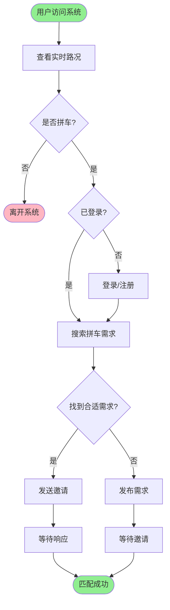

# 第三章 可行性分析

## 3.1 技术可行性

### 3.1.1 前端技术可行性

**Vue 3框架选择**

Vue 3是目前主流的前端框架之一,相比Vue 2有以下优势:
- 更好的TypeScript支持
- Composition API提供更灵活的代码组织方式
- 性能提升,打包体积减小
- 响应式系统重构,更高效的数据追踪

系统使用的Vue 3.5.22版本是当前稳定版本,配合以下技术栈:
- **Vue Router 4.6.3**:官方路由管理器,支持路由懒加载和导航守卫
- **Pinia 3.0.4**:新一代状态管理库,替代Vuex,API更简洁
- **Element Plus 2.11.8**:基于Vue 3的UI组件库,提供丰富的组件
- **ECharts 6.0.0**:百度开源的数据可视化库,适合路况图表展示
- **Axios 1.13.2**:HTTP客户端,支持拦截器便于JWT认证集成

**前端技术成熟度分析**

以上技术均经过大量生产环境验证,社区活跃,文档完善,遇到问题可以快速找到解决方案。开发团队对Vue生态有较为深入的了解,学习成本较低。

### 3.1.2 后端技术可行性

**Spring Boot框架优势**

系统采用Spring Boot 3.5.7(基于Java 21),具有以下优势:

1. **快速开发**:自动配置、起步依赖简化开发流程
2. **微服务架构**:易于拆分为多个独立服务
3. **生态完善**:Spring生态系统提供丰富的扩展
4. **性能优秀**:基于JVM,性能经过长期优化

**技术栈组成**:
- **Spring Data JPA**:ORM框架,简化数据库操作
- **Spring Security Crypto**:提供BCrypt密码加密
- **JWT (jjwt 0.12.3)**:无状态认证方案
- **MySQL Connector**:数据库连接
- **Apache Flink 1.16.3**:流处理引擎(预留扩展)

**技术风险评估**:

| 技术点 | 风险等级 | 应对措施 |
|-------|---------|---------|
| Spring Boot 3.x | 低 | 官方文档完善,社区成熟 |
| Java 21 | 低 | LTS版本,长期支持 |
| JWT认证 | 低 | 标准方案,实现简单 |
| JPA性能优化 | 中 | 建立索引,使用@Query优化 |
| WebSocket实时通信 | 中 | 备选方案:轮询机制 |

### 3.1.3 数据库技术可行性

**MySQL 8.0选型理由**

1. **成熟稳定**:全球使用最广泛的开源数据库
2. **性能优秀**:支持索引优化、查询缓存
3. **事务支持**:ACID特性保证数据一致性
4. **社区支持**:丰富的文档、工具、人才储备

**数据库设计考虑**:
- 使用InnoDB引擎,支持事务和外键
- 合理设计索引,提升查询性能
- 使用JPA生命周期回调自动管理时间戳
- 预留扩展字段,便于功能迭代

**数据量估算**:
- 交通数据:每5分钟采集一次,每天约288条/道路
- 假设监测50条道路,每日约14,400条记录
- 年数据量约525万条,MySQL完全可承受
- 可按月/季度归档历史数据

### 3.1.4 数据采集技术可行性

**Python脚本优势**:
- 简洁易读,维护方便
- 丰富的第三方库(requests、pymysql)
- 跨平台支持
- 定时任务调度简单(time.sleep或schedule库)

**百度地图API集成**:
- RESTful API,调用简单
- 返回JSON格式,易于解析
- 免费额度足够学术项目使用
- 文档清晰,示例丰富

**容错机制设计**:
- API调用失败自动重试
- 数据库连接异常处理
- 日志记录便于问题排查
- 异常捕获不中断后续采集

### 3.1.5 地图集成可行性

**高德地图API选择**:

前端使用高德地图JavaScript API进行路况可视化,优势如下:
- 国内地图数据准确
- API文档详细,示例丰富
- 免费额度充足
- 支持多种图表样式

**技术实现**:
- 使用AMap JS API 2.0
- 标注道路位置,颜色表示拥堵等级
- 支持缩放、拖拽等交互
- 性能优化:聚合标注、按需加载

## 3.2 应用可行性

### 3.2.1 操作可行性

**用户群体分析**:

1. **普通用户**(学生、上班族):
   - 日常出行需求明确
   - 乐于接受新事物
   - 移动设备普及率高

2. **拼车参与者**:
   - 降低出行成本
   - 减少驾驶疲劳
   - 环保意识增强

**用户操作流程分析**:

操作流程简单直观,符合用户认知习惯。界面设计参考主流拼车平台(如滴滴拼车、哈啰出行),降低学习成本。

### 3.2.2 经济可行性

**开发成本**:

1. **人力成本**:
   - 需求分析与设计:1人周
   - 后端开发:2人周
   - 前端开发:2人周
   - 数据采集脚本:0.5人周
   - 测试与优化:1人周
   - 文档编写:0.5人周
   - **总计**:约7人周(1.5个月)

2. **硬件成本**:
   - 开发服务器:可使用个人电脑
   - 测试服务器:学生云服务器(免费/低价)
   - 生产服务器:根据规模选择,初期低成本方案

3. **软件成本**:
   - 开发工具:VS Code、IntelliJ IDEA(免费)
   - 数据库:MySQL Community Server(免费)
   - 框架与库:开源免费
   - API服务:百度/高德免费额度

**运维成本**:
- 服务器租赁:约¥100-300/月(入门级云服务器)
- 域名:约¥50-100/年
- API超额:按需付费(初期免费额度足够)

**经济效益**:

1. **直接效益**:
   - 拼车成功减少单人出行成本
   - 降低车辆损耗和油费/电费
   - 减少停车费用

2. **间接效益**:
   - 缓解交通拥堵,社会效益
   - 减少碳排放,环保效益
   - 提高车辆利用率,资源节约

3. **学术价值**:
   - 课程设计/毕业设计成果
   - 数据库设计实践
   - 全栈开发能力证明

**投资回报分析**:
- 初期投入:约¥500-1000(域名+3个月服务器)
- 后续运营:约¥100-300/月
- 单次拼车节省:¥5-20(视距离而定)
- 月节省10次即可覆盖运营成本

**结论**:从经济角度分析,系统投入成本低,效益明显,具有较好的经济可行性。

### 3.2.3 法律可行性

**用户隐私保护**:

1. **数据收集**:
   - 仅收集必要信息(用户名、手机号等)
   - 明确隐私政策和用户协议
   - 用户可主动删除账号

2. **数据存储**:
   - 密码BCrypt加密,不可逆
   - JWT令牌有过期时间
   - 敏感信息脱敏展示

3. **数据传输**:
   - HTTPS加密传输
   - 防止中间人攻击

**法律合规性**:

1. **《网络安全法》**:
   - 用户实名认证(手机号验证)
   - 数据安全保护
   - 日志留存(至少6个月)

2. **《个人信息保护法》**:
   - 最小必要原则收集信息
   - 明确告知用户使用目的
   - 提供注销账号功能

3. **《数据安全法》**:
   - 数据分类分级保护
   - 定期备份
   - 应急预案

**风险防范**:
- 制定详细的用户协议和隐私政策
- 避免收集与业务无关的个人信息
- 建立数据泄露应急预案
- 定期安全审计

### 3.2.4 社会可行性

**社会需求**:

1. **交通拥堵问题**:
   - 大城市早晚高峰拥堵严重
   - 出行时间长,成本高
   - 拼车可有效减少上路车辆

2. **环保意识提升**:
   - 碳达峰、碳中和目标
   - 绿色出行理念普及
   - 共享经济接受度提高

3. **经济压力**:
   - 油价上涨,出行成本增加
   - 拼车分摊成本,吸引力大

**用户接受度**:

1. **年轻群体**:
   - 对新鲜事物接受度高
   - 环保意识强
   - 经济实用主义

2. **通勤族**:
   - 固定路线,规律出行
   - 拼车需求稳定
   - 成本敏感

**潜在问题与对策**:

| 问题 | 影响 | 对策 |
|-----|------|------|
| 信任问题 | 用户不敢拼车 | 实名认证、手机号验证、评价系统 |
| 安全问题 | 担心人身安全 | 紧急联系、行程分享、实名制 |
| 信用问题 | 放鸽子行为 | 信用积分、黑名单机制 |
| 匹配效率 | 难找到合适对象 | 智能推荐算法、扩大用户基础 |

### 3.2.5 技术风险与对策

**主要风险点**:

1. **API限流风险**:
   - 风险:百度/高德API免费额度有限
   - 对策:缓存热点数据、减少不必要的API调用、升级付费套餐

2. **数据库性能风险**:
   - 风险:数据量增长后查询变慢
   - 对策:建立索引、分表分库、定期归档历史数据

3. **并发访问风险**:
   - 风险:高峰期服务器压力过大
   - 对策:负载均衡、CDN加速、缓存优化

4. **数据一致性风险**:
   - 风险:拼车匹配过程中数据异常
   - 对策:使用事务、乐观锁、幂等性设计

5. **第三方依赖风险**:
   - 风险:第三方API停止服务或变更
   - 对策:设计抽象层、支持多API切换、版本锁定

## 3.3 可行性结论

### 3.3.1 综合评估

| 评估维度 | 可行性 | 说明 |
|---------|--------|------|
| 技术可行性 | ★★★★☆ | 技术栈成熟,团队有相关经验 |
| 应用可行性 | ★★★★☆ | 用户需求明确,操作简单 |
| 经济可行性 | ★★★★★ | 成本低,效益明显 |
| 法律可行性 | ★★★★☆ | 需注意隐私保护,但合规可控 |
| 社会可行性 | ★★★★☆ | 符合环保理念,有推广价值 |

### 3.3.2 建议与展望

**实施建议**:
1. 分阶段开发,先实现核心功能,再逐步扩展
2. 重点关注用户体验,简化操作流程
3. 建立完善的测试体系,保证系统稳定性
4. 加强数据安全保护,建立用户信任

**未来扩展方向**:
1. 接入实时位置追踪,提升安全性
2. 引入智能推荐算法,提高匹配效率
3. 支持多种支付方式(费用分摊)
4. 建立信用评价体系
5. 扩展到更多城市和道路
6. 对接公共交通数据,提供综合出行方案

**总结**:
本系统在技术、经济、法律、社会等多个维度均具备良好的可行性。项目采用成熟的技术栈,开发成本低,周期可控。系统功能实用,符合当前社会需求,具有良好的应用前景和推广价值。建议尽快启动项目实施,并在开发过程中持续优化和迭代。
