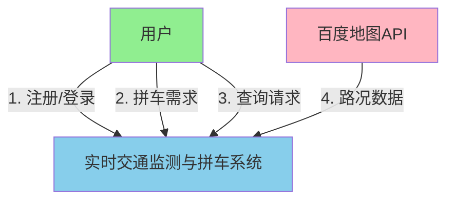
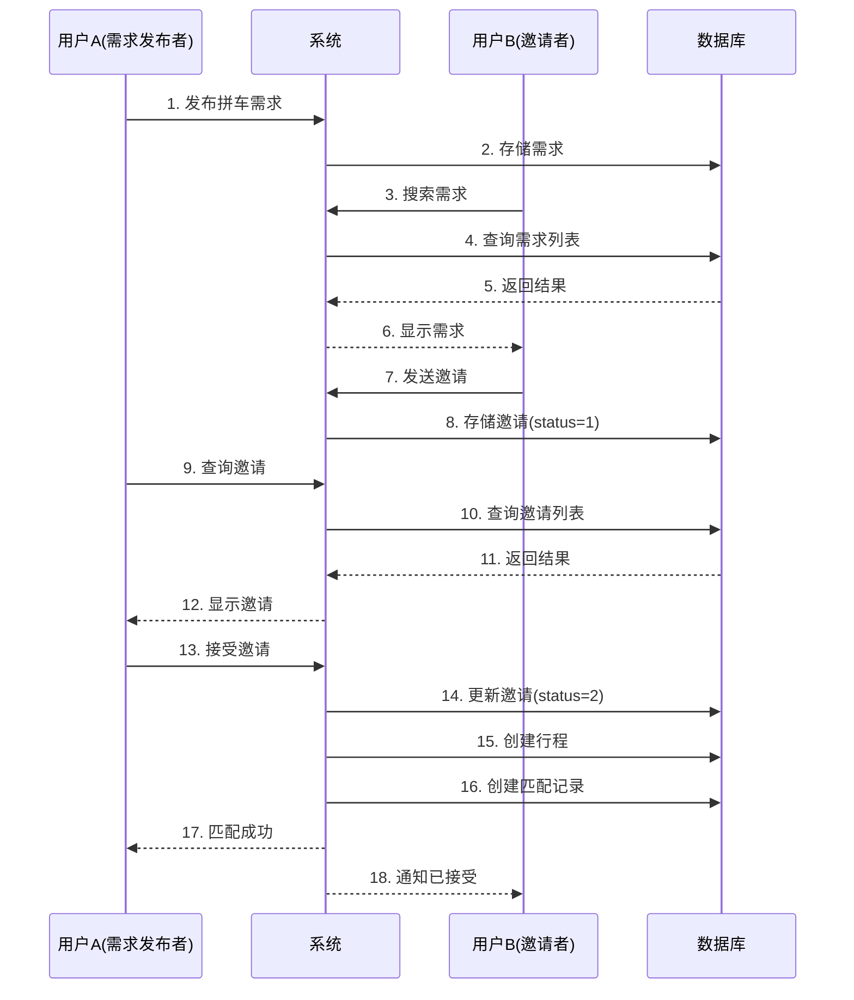
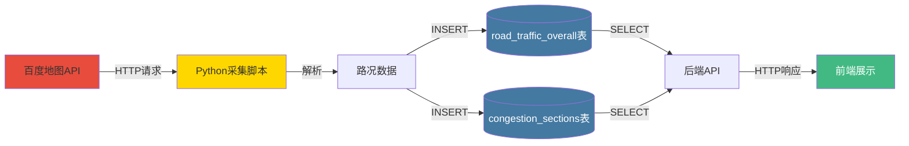
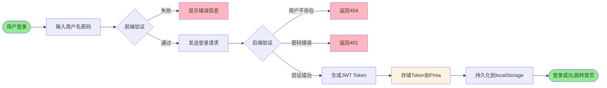

# 第二章 需求分析

## 2.1 功能需求

### 2.1.1 用户管理模块

#### 用户注册与登录

**功能描述**:系统提供用户注册和登录功能,支持用户名密码认证方式。

**输入数据**:
- 用户名(3-50字符,唯一)
- 密码(6-50字符)
- 手机号(选填,需格式验证)
- 邮箱(选填,需格式验证)
- 真实姓名(选填)

**处理逻辑**:
1. 前端表单验证(用户名格式、密码强度、手机号邮箱格式)
2. 后端验证用户名唯一性
3. 使用BCrypt算法加密密码
4. 生成JWT令牌(有效期7天)
5. 将令牌和用户信息返回前端

**输出数据**:
- JWT令牌
- 用户基本信息(ID、用户名、手机号等)

#### 个人信息管理

用户登录后可以查看和修改个人资料,包括手机号、邮箱、真实姓名等信息的更新。系统支持密码修改功能,需要验证旧密码后设置新密码。

### 2.1.2 实时交通监测模块

#### 路况数据查询

**功能描述**:用户可以查询实时交通数据,支持多种查询条件。

**查询条件**:
- 按城市查询
- 按道路名称查询
- 按拥堵等级筛选(0-4级)
- 关键词搜索

**返回数据**:
- 道路名称、城市
- 路况描述
- 拥堵等级及描述
- 平均速度(km/h)
- 拥堵距离(米)
- 拥堵趋势(持平/缓解/加重)
- 更新时间

#### 交通统计分析

系统提供交通统计数据,包括各拥堵等级道路数量、占比等信息,帮助用户了解整体交通状况。

#### 历史数据查询

用户可以查询指定道路在特定时间范围内的历史交通数据,用于分析交通变化趋势。

### 2.1.3 拼车服务模块

#### 拼车需求发布

**输入数据**:
- 是否有车(布尔值)
- 乘客人数
- 最大乘客数
- 起点/终点位置及坐标
- 出发时间范围(最早/最晚)
- 联系电话

**处理逻辑**:
1. 验证用户登录状态
2. 验证时间范围合法性
3. 验证乘客人数<=最大乘客数
4. 创建需求记录,状态设为"等待匹配"

#### 拼车需求搜索

用户可以根据起点、终点、出发时间、是否有车等条件搜索合适的拼车需求。系统排除自己发布的需求,仅返回"等待匹配"状态的需求。

#### 拼车邀请管理

**发送邀请流程**:
1. 用户浏览拼车需求
2. 向感兴趣的需求发送邀请
3. 填写乘客人数和留言
4. 系统创建邀请记录(status=1待处理)

**处理邀请流程**:
- 接受邀请:创建行程记录、拒绝其他邀请、更新需求状态
- 拒绝邀请:更新邀请状态为"已拒绝"
- 取消邀请:邀请者可取消待处理的邀请

### 2.1.4 行程管理模块

#### 行程生成

当需求发布者接受邀请后,系统自动创建行程记录,包括:
- 起点、终点及坐标
- 出发、到达时间
- 参与用户及乘客总数
- 行程状态

#### 行程状态更新

行程状态包括:待出发、进行中、已完成、已取消。参与者可以更新行程状态。

### 2.1.5 数据采集模块

Python脚本定期(每5分钟)调用百度地图API采集交通数据:

**采集流程**:
1. 读取配置文件获取监测道路列表
2. 调用百度路况查询API
3. 解析JSON响应
4. 提取路况概览和拥堵路段信息
5. 保存到MySQL数据库
6. 记录采集日志
7. 等待下一个采集周期

## 2.2 数据字典

### 2.2.1 数据元素定义

**用户信息**:
| 数据项 | 类型 | 长度 | 描述 | 约束 |
|-------|------|------|------|------|
| id | BIGINT | - | 用户唯一标识 | 主键,自增 |
| username | VARCHAR | 50 | 用户名 | 唯一,非空 |
| password | VARCHAR | 255 | 密码(BCrypt加密) | 非空 |
| phone_number | VARCHAR | 20 | 手机号 | 格式验证 |
| email | VARCHAR | 100 | 邮箱 | 格式验证 |
| real_name | VARCHAR | 50 | 真实姓名 | - |
| status | INT | - | 账号状态 | 1-正常,0-禁用 |

**交通信息**:
| 数据项 | 类型 | 长度 | 描述 | 约束 |
|-------|------|------|------|------|
| id | BIGINT | - | 记录ID | 主键,自增 |
| road_name | VARCHAR | 100 | 道路名称 | 非空 |
| city | VARCHAR | 50 | 城市名称 | 非空 |
| evaluation_status | INT | - | 拥堵等级 | 0-4 |
| speed | DECIMAL | (5,2) | 平均速度(km/h) | - |
| congestion_distance | INT | - | 拥堵距离(米) | - |
| congestion_trend | VARCHAR | 20 | 拥堵趋势 | 持平/缓解/加重 |

**拼车信息**:
| 数据项 | 类型 | 长度 | 描述 | 约束 |
|-------|------|------|------|------|
| id | BIGINT | - | 需求/邀请/行程ID | 主键,自增 |
| user_id | BIGINT | - | 用户ID | 外键 |
| has_car | BOOLEAN | - | 是否有车 | - |
| passenger_count | INT | - | 乘客人数 | >=1 |
| start_location | VARCHAR | 255 | 起点 | 非空 |
| end_location | VARCHAR | 255 | 终点 | 非空 |
| status | INT | - | 状态 | 1-待处理,2-已接受,3-已拒绝,4-已取消 |

### 2.2.2 数据结构

系统主要包含7个数据表:

1. **users**:用户基本信息
2. **road_traffic_overall**:路况概览信息
3. **congestion_sections**:拥堵路段详情
4. **carpool_request**:拼车需求
5. **carpool_invitation**:拼车邀请
6. **trip_record**:行程记录
7. **match_record**:匹配记录

各表之间的关联关系通过外键实现,确保数据的参照完整性。

## 2.3 数据流图

### 2.3.1 顶层数据流图

### 2.3.2 拼车匹配数据流图

### 2.3.3 路况数据采集数据流图

### 2.3.4 用户认证数据流图

通过以上需求分析,明确了系统的功能模块、数据结构和数据流转过程,为后续的系统设计和实现奠定了基础。
