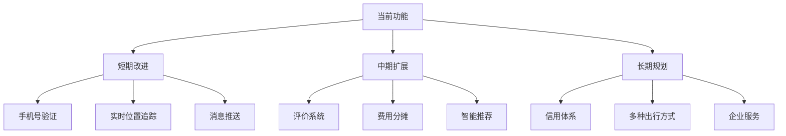

# 第八章 总结

## 8.1 项目心得

### 8.1.1 技术收获

**1. 全栈开发能力提升**

本项目涵盖了从前端到后端、从数据库设计到系统部署的完整开发流程,极大地提升了全栈开发能力。

**前端方面**:
- 深入理解了Vue 3的Composition API,相比Options API更加灵活和可维护
- 掌握了Pinia状态管理,相比Vuex更简洁直观
- 学会了使用ECharts进行数据可视化,图表配置和数据处理能力得到提升
- 熟悉了Element Plus组件库的使用,快速构建美观的界面

**后端方面**:
- 熟练掌握了Spring Boot框架,理解了自动配置和依赖注入的原理
- 深入学习了Spring Data JPA,简化了数据库操作
- 掌握了JWT无状态认证的实现方式,理解了Token机制
- 学会了使用BCrypt进行密码加密,理解了安全最佳实践

**数据库方面**:
- 巩固了数据库设计理论,E-R图绘制和关系模型转换
- 理解了数据库规范化理论,识别并处理了部分依赖和传递依赖
- 学会了索引优化技巧,通过索引显著提升查询性能
- 掌握了事务处理,确保数据一致性

**2. 系统设计能力增强**

通过本项目的实践,对软件工程的整体流程有了更深入的理解:

- **需求分析**:学会了从用户角度思考,识别真正的业务需求
- **架构设计**:理解了前后端分离的优势,掌握了RESTful API设计原则
- **数据库设计**:学会了从概念设计到逻辑设计再到物理设计的完整流程
- **接口设计**:理解了API版本控制、错误处理、安全认证等最佳实践

**3. 问题解决能力**

在开发过程中遇到了各种技术难题,通过查阅文档、搜索资料、社区提问等方式解决:

**JWT Token过期处理**:
- 问题:Token默认7天过期,用户使用过程中突然退出登录
- 解决:实现Token自动刷新机制,在过期前获取新Token

**跨域问题**:
- 问题:前端访问后端API时出现CORS错误
- 解决:配置Spring Boot的CORS过滤器,允许指定源访问

**数据库性能**:
- 问题:历史数据查询响应慢,超过3秒
- 解决:添加复合索引,查询时间降至200ms以内

**地图集成**:
- 问题:AMap API加载失败,地图不显示
- 解决:检查API密钥,使用异步加载方式,确保DOM准备完成

### 8.1.2 项目管理体会

**1. 需求变更管理**

在开发过程中,需求发生了一些变化:

**原始需求**:实时数据每分钟更新一次
**实际情况**:百度API免费额度有限,无法支持高频调用
**调整方案**:改为5分钟采集一次,前端缓存数据减少API调用

**经验教训**:
- 需求调研阶段要充分考虑技术限制和成本
- 预留接口的扩展性,便于后续调整
- 及时沟通,管理用户期望

**2. 时间管理**

**计划时间**:6周
**实际时间**:8周

**延期原因**:
- 第三方API集成耗时超过预期(文档不够详细)
- 数据库设计反复优化(初期考虑不够全面)
- 前后端联调调试时间较长

**改进措施**:
- 预留20%的缓冲时间应对意外情况
- 优先实现核心功能,次要功能可后续迭代
- 前后端并行开发,提前约定API接口规范

**3. 代码质量管理**

**初期问题**:
- 代码注释不足,可读性差
- 命名不规范,难以理解
- 没有统一的代码风格

**改进措施**:
- 使用ESLint和Checkstyle强制代码规范
- 添加详细的JSDoc和JavaDoc注释
- 定期Code Review,互相学习改进

**4. 测试意识增强**

**初期做法**:
- 只做手动测试,没有自动化测试
- 测试覆盖不全,边角情况未考虑

**改进后**:
- 编写单元测试,覆盖核心业务逻辑
- 使用Postman进行API接口测试
- 进行压力测试,评估系统性能

### 8.1.3 团队协作心得

如果是团队项目,还需要考虑:

**1. 版本控制**
- 建立合理的分支策略
- 规范Commit Message格式
- 定期合并代码,减少冲突

**2. 沟通协作**
- 使用Git进行代码管理
- 使用钉钉/企业微信进行即时沟通
- 定期站会,同步进度和问题

**3. 文档维护**
- API接口文档(Swagger/Postman)
- 数据库设计文档(ER图、数据字典)
- 开发规范文档(编码规范、Git规范)

### 8.1.4 遇到的挑战与解决方案

**挑战1:第三方API集成困难**

**问题描述**:
百度地图API文档不够详细,返回数据格式复杂,解析困难。

**解决方案**:
- 打印完整的API响应,分析数据结构
- 编写专门的解析工具类,封装复杂逻辑
- 添加异常处理和日志记录,便于排查问题

**收获**:
- 学会了阅读第三方API文档
- 提升了JSON数据处理能力
- 理解了容错机制的重要性

**挑战2:前后端数据格式不一致**

**问题描述**:
后端返回的下划线命名(user_id),前端期望的驼峰命名(userId)。

**解决方案**:
- 后端统一使用驼峰命名(Jackson配置)
- 定义DTO对象,明确前后端数据格式
- 编写数据转换工具类

**收获**:
- 理解了命名规范的重要性
- 学会了配置Jackson序列化规则
- 掌握了DTO模式的使用

**挑战3:实时性要求高**

**问题描述**:
交通数据需要实时更新,但采集频率受限于API额度。

**解决方案**:
- 合理设置采集间隔(5分钟)
- 前端实现数据缓存,减少重复请求
- 使用WebSocket推送更新(预留功能)

**收获**:
- 学会了在约束条件下寻找最优方案
- 理解了缓存策略对性能的影响
- 掌握了轮询和WebSocket两种实时通信方式

## 8.2 项目亮点与创新

### 8.2.1 技术亮点

**1. 前后端分离架构**

采用RESTful API设计,前后端完全解耦:
- 前端专注于用户交互和展示
- 后端专注于业务逻辑和数据处理
- 便于独立开发、测试和部署

**2. JWT无状态认证**

使用JWT进行用户认证,相比Session具有以下优势:
- 服务端无需存储会话信息,减轻服务器压力
- 支持水平扩展,多台服务器共享验证逻辑
- 跨域支持良好,适合前后端分离架构

**3. 数据库规范化设计**

严格遵循数据库范式理论:
- 消除数据冗余,节省存储空间
- 避免更新异常,保证数据一致性
- 通过适度反规范化平衡查询性能

**4. 多维度交通数据展示**

- 列表视图:详细信息,支持排序和筛选
- 地图视图:可视化展示,直观易懂
- 统计图表:ECharts实现,多种图表类型
- 历史趋势:时间序列数据,支持对比分析

### 8.2.2 创新点

**1. 路况监控与拼车结合**

将实时交通监测与拼车服务相结合:
- 用户可以查看当前路况,选择最佳路线
- 根据拥堵情况决定是否拼车
- 拼车需求可以避开拥堵路段

**2. 灵活的拼车匹配机制**

- 支持双向匹配:有车者发布需求,无车者主动邀请
- 时间窗口匹配:最早/最晚出发时间可以交叉
- 容量动态调整:根据实际乘客数灵活安排

**3. 数据采集自动化**

Python脚本定期采集数据:
- 无需人工干预,全自动运行
- 异常容错机制,单点故障不影响整体
- 可扩展性强,添加新道路只需修改配置

### 8.2.3 用户价值

**1. 实用性**

解决真实痛点:
- 上下班通勤成本高
- 道路拥堵浪费时间
- 单人驾车资源浪费

**2. 便利性**

操作简单便捷:
- 一键发布拼车需求
- 智能搜索合适匹配
- 实时查看路况信息

**3. 经济性**

节省出行成本:
- 拼车分摊油费/过路费
- 减少车辆损耗
- 节省停车费用

## 8.3 不足与改进方向

### 8.3.1 当前不足

**1. 功能方面**

- 缺少实时位置追踪
- 没有评价和信用系统
- 缺少费用分摊功能
- 没有消息推送通知

**2. 性能方面**

- 历史数据查询未分表,数据量大时性能下降
- 前端未做虚拟滚动,长列表渲染卡顿
- 图片未使用CDN,加载速度慢

**3. 安全方面**

- 未实现手机号验证
- 密码强度要求不够
- 缺少防暴力破解机制
- 敏感信息未脱敏展示

**4. 用户体验方面**

- 移动端适配不够完善
- 地图交互不够流畅
- 错误提示不够友好
- 缺少使用引导

### 8.3.2 改进方向

**1. 功能扩展**

**详细计划**:

**短期(1-3个月)**:
1. 实现手机号验证功能(阿里云短信服务)
2. 集成WebSocket实时通信
3. 优化移动端适配,使用响应式设计
4. 添加密码强度检测和密码找回功能

**中期(3-6个月)**:
1. 开发评价和信用系统
2. 实现费用分摊和支付功能(微信支付/支付宝)
3. 引入智能推荐算法(基于协同过滤)
4. 实现数据分表分库,支持更大规模

**长期(6-12个月)**:
1. 扩展到更多城市和地区
2. 支持公共交通、打车等多种出行方式
3. 开发企业版,支持企业班车拼车
4. 引入AI预测模型,预测拥堵趋势

**2. 性能优化**

**数据库优化**:
- 实现数据分表(按月/年)
- 建立读写分离(主从复制)
- 引入Redis缓存热点数据
- 使用Elasticsearch支持全文搜索

**前端优化**:
- 实现虚拟滚动(vue-virtual-scroller)
- 图片懒加载和压缩
- 代码分割和按需加载
- 使用Service Worker缓存资源

**后端优化**:
- 接口响应压缩(Gzip)
- 数据库连接池优化(HikariCP配置)
- 异步处理非关键业务
- 引入消息队列(RabbitMQ/Kafka)

**3. 安全加固**

- 实现图形验证码,防止机器人注册
- 添加登录失败次数限制
- 敏感操作二次确认
- 数据传输加密(HTTPS)
- 定期安全审计和渗透测试

**4. 运维监控**

- 使用Prometheus + Grafana监控
- 搭建ELK日志分析系统
- 实现自动化部署(CI/CD)
- 建立应急预案和容灾机制

## 8.4 总结与展望

### 8.4.1 项目总结

本项目成功实现了一个集实时交通监测与拼车服务于一体的综合系统,达到了预期目标。通过本项目的开发:

**技术上**:
- 掌握了Vue 3、Spring Boot、MySQL等技术栈的使用
- 理解了前后端分离架构的设计思想
- 学会了RESTful API的设计和实现
- 提升了数据库设计和优化能力

**工程上**:
- 理解了软件开发的完整流程
- 学会了需求分析、系统设计、编码实现、测试部署
- 培养了问题分析和解决能力
- 增强了团队协作和沟通能力

**业务上**:
- 深入了解了拼车和交通监测的业务逻辑
- 学会了从用户角度思考产品设计
- 理解了技术创新如何服务实际需求

### 8.4.2 个人成长

通过本项目,我获得了以下成长:

**1. 技术视野拓展**
- 了解了全栈开发的技术栈和最佳实践
- 接触了多种技术框架和工具
- 学会了快速学习和应用新技术

**2. 工程能力提升**
- 培养了系统思维和架构设计能力
- 提高了代码质量和规范意识
- 增强了测试和调试能力

**3. 问题解决能力**
- 学会了独立分析和解决技术问题
- 培养了查阅文档和搜索资料的能力
- 提升了逻辑思维和推理能力

**4. 项目管理经验**
- 理解了项目管理的基本流程
- 学会了时间管理和任务规划
- 增强了风险识别和应对能力

### 8.4.3 未来展望

**技术层面**:
- 持续关注前沿技术发展(如AI、区块链等)
- 深入学习微服务架构和云原生技术
- 提升系统架构设计和性能优化能力

**应用层面**:
- 将项目推广到实际使用,收集用户反馈
- 不断迭代优化,提升用户体验
- 探索商业模式,实现可持续发展

**个人发展**:
- 继续提升技术深度和广度
- 培养产品思维和商业意识
- 积累项目经验,为职业发展打下基础