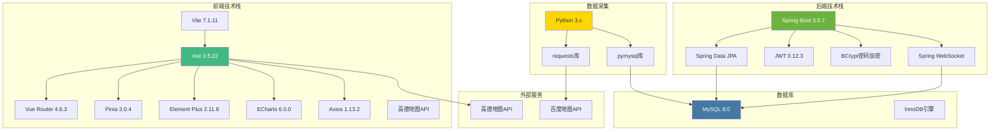

# 第六章 项目管理

## 6.1 框架选择

### 6.1.1 前端框架选择

#### Vue 3 vs React vs Angular

| 对比维度 | Vue 3 | React | Angular |
|---------|-------|-------|---------|
| **学习曲线** | 平缓,文档清晰 | 中等,需掌握JSX | 陡峭,概念多 |
| **开发效率** | 高,语法简洁 | 中等,灵活但需选择生态 | 中等,模板固定 |
| **性能** | 优秀,响应式系统优化 | 优秀,虚拟DOM | 良好,依赖Zone.js |
| **生态** | 完善,Vue Router/Pinia | 最丰富,社区最大 | 完整,官方全家桶 |
| **TypeScript支持** | 优秀 | 优秀 | 原生支持 |
| **适用场景** | 中小型项目,快速开发 | 大型项目,高度定制 | 企业级应用 |

**最终选择:Vue 3**

**选择理由**:

1. **学习成本低**:
   - 语法简洁,接近原生JavaScript
   - 单文件组件(SFC)易于理解
   - 官方文档详细,中文友好

2. **开发效率高**:
   - Composition API代码组织灵活
   - 模板语法直观,减少样板代码
   - Vite构建工具,开发体验优秀

3. **生态完善**:
   - Vue Router 4路由管理
   - Pinia状态管理
   - Element Plus UI组件库
   - ECharts数据可视化

4. **团队熟悉度**:
   - 开发团队有Vue经验
   - 便于快速上手和问题排查

#### 技术栈组成

**核心框架**:
- Vue 3.5.22:渐进式JavaScript框架
- Vue Router 4.6.3:官方路由管理器
- Pinia 3.0.4:官方状态管理库

**UI与可视化**:
- Element Plus 2.11.8:基于Vue 3的组件库
- ECharts 6.0.0:数据可视化库
- vue-echarts 8.0.1:ECharts的Vue封装

**工具库**:
- Axios 1.13.2:HTTP客户端
- Vite 7.1.11:构建工具

**地图集成**:
- AMap (高德地图) JavaScript API 2.0:地图展示

### 6.1.2 后端框架选择

#### Spring Boot vs Spring MVC vs Node.js

| 对比维度 | Spring Boot | Spring MVC | Node.js + Express |
|---------|------------|-----------|------------------|
| **开发效率** | 高,自动配置 | 中,需手动配置 | 高,轻量级 |
| **性能** | 优秀,JVM优化 | 良好 | 优秀,异步非阻塞 |
| **生态** | 完善,Spring全家桶 | 丰富 | npm生态 |
| **数据库支持** | JPA/MyBatis等ORM | 同左 | 需选择ORM |
| **企业级应用** | 广泛使用 | 较少 | 逐渐增多 |
| **适用场景** | 企业级后端 | 传统Web应用 | 高并发、实时应用 |

**最终选择:Spring Boot 3.5.7**

**选择理由**:

1. **快速开发**:
   - 自动配置,减少繁琐配置
   - 起步依赖,简化依赖管理
   - 内嵌服务器,便于部署

2. **企业级特性**:
   - 成熟的生态系统
   - 强大的安全支持(Spring Security)
   - 便于扩展和集成

3. **数据库集成**:
   - Spring Data JPA简化数据库操作
   - Hibernate ORM提供对象关系映射
   - 支持多种数据库(MySQL/PostgreSQL等)

4. **微服务架构**:
   - Spring Cloud支持微服务开发
   - 便于未来扩展和拆分

#### 后端技术栈

**核心框架**:
- Spring Boot 3.5.7:应用框架
- Spring Data JPA:数据持久化
- Hibernate 6.4:ORM实现

**安全认证**:
- Spring Security Crypto:密码加密
- JWT (jjwt 0.12.3):无状态认证
- BCrypt:密码哈希算法

**数据库**:
- MySQL Connector 8.0.33:数据库驱动
- HikariCP:连接池(默认)

**其他技术**:
- Apache Flink 1.16.3:流处理(预留)
- Spring WebSocket:实时通信
- Jackson:JSON序列化

### 6.1.3 数据库选择

#### MySQL vs PostgreSQL vs MongoDB

| 对比维度 | MySQL 8.0 | PostgreSQL | MongoDB |
|---------|----------|------------|---------|
| **数据模型** | 关系型 | 关系型 | 文档型 |
| **性能** | 优秀 | 优秀 | 良好 |
| **事务支持** | 完整ACID | 完整ACID | 多文档事务 |
| **查询能力** | 强大SQL | 更强的SQL | MQL |
| **索引支持** | B-Tree/Hash等 | 更多索引类型 | 多种索引 |
| **成熟度** | 非常成熟 | 非常成熟 | 较成熟 |
| **适用场景** | Web应用/企业级 | 复杂查询/数据分析 | 灵活模式/海量数据 |

**最终选择:MySQL 8.0**

**选择理由**:

1. **成熟稳定**:
   - 全球使用最广泛的开源数据库
   - 经过大量生产环境验证
   - 社区活跃,问题易解决

2. **性能优秀**:
   - InnoDB引擎支持事务和外键
   - 查询优化器智能
   - 支持索引、分区等性能优化

3. **开发便利**:
   - SQL标准,学习成本低
   - ORM支持完善(JPA/Hibernate)
   - 丰富的管理和监控工具

4. **成本考量**:
   - 开源免费
   - 云服务支持(AWS RDS、阿里云RDS等)
   - 人才储备充足

### 6.1.4 数据采集技术选择

#### Python vs Node.js vs Java

| 对比维度 | Python | Node.js | Java |
|---------|--------|---------|------|
| **开发效率** | 最高 | 高 | 中等 |
| **库支持** | 丰富(requests/pymysql) | 丰富 | 丰富 |
| **执行性能** | 较低 | 高 | 高 |
| **跨平台** | 优秀 | 优秀 | 优秀(JVM) |
| **部署简单** | 是 | 是 | 否(需JVM) |
| **适用场景** | 脚本/数据处理 | 高并发/I/O密集 | 企业级应用 |

**最终选择:Python 3**

**选择理由**:

1. **简洁易读**:
   - 语法清晰,维护方便
   - 代码量少,开发效率高

2. **库支持**:
   - requests:简单的HTTP客户端
   - pymysql:MySQL数据库驱动
   - json:JSON解析内置

3. **定时任务**:
   - schedule库:轻量级定时任务
   - time.sleep:简单循环
   - crontab:系统级定时

4. **跨平台**:
   - Windows/Linux/macOS通用
   - 便于不同环境部署

### 6.1.5 技术栈总览



## 6.2 开发平台

### 6.2.1 硬件环境

**开发环境配置**:

| 组件 | 最低配置 | 推荐配置 |
|------|---------|---------|
| **CPU** | Intel i5 / AMD Ryzen 5 | Intel i7 / AMD Ryzen 7 |
| **内存** | 8GB | 16GB |
| **硬盘** | 256GB SSD | 512GB SSD |
| **显示器** | 1920x1080 | 2K分辨率 |

**服务器配置**:

| 阶段 | CPU | 内存 | 硬盘 | 带宽 |
|------|-----|------|------|------|
| **开发测试** | 2核 | 4GB | 40GB SSD | 1Mbps |
| **生产环境(初期)** | 4核 | 8GB | 100GB SSD | 5Mbps |
| **生产环境(扩展)** | 8核+ | 16GB+ | 500GB+ | 10Mbps+ |

### 6.2.2 软件环境

**操作系统**:
- **开发环境**:Windows 10/11、macOS、Ubuntu 20.04+
- **生产环境**:Ubuntu 22.04 LTS / CentOS 8+

**开发工具**:

| 类型 | 工具 | 用途 |
|------|------|------|
| **前端IDE** | VS Code 1.80+ | Vue开发 |
| **后端IDE** | IntelliJ IDEA 2023+ | Spring Boot开发 |
| **数据库管理** | MySQL Workbench / Navicat | 数据库管理 |
| **API测试** | Postman / Apifox | 接口测试 |
| **版本控制** | Git 2.40+ | 代码管理 |
| **终端工具** | Windows Terminal / iTerm2 | 命令行操作 |

**运行时环境**:

| 组件 | 版本 | 说明 |
|------|------|------|
| **Node.js** | v20.19.0+ | 前端运行环境 |
| **npm** | v10.0+ | 包管理器 |
| **Java** | JDK 21 | 后端运行环境 |
| **Gradle** | 8.5+ | 构建工具 |
| **Python** | 3.9+ | 数据采集脚本 |
| **MySQL** | 8.0.33+ | 数据库 |

### 6.2.3 开发环境搭建

#### 前端开发环境搭建

**1. 安装Node.js和npm**:
```bash
# 下载并安装Node.js
# 验证安装
node -v
npm -v
```

**2. 安装Vue CLI**:
```bash
npm install -g @vue/cli
vue --version
```

**3. 创建Vue项目**:
```bash
npm create vue@latest carpool-f
cd carpool-f
npm install
```

**4. 安装依赖**:
```bash
npm install vue-router@4 pinia axios element-plus
npm install echarts vue-echarts
npm install -D vite @vitejs/plugin-vue
```

**5. 启动开发服务器**:
```bash
npm run dev
```

#### 后端开发环境搭建

**1. 安装JDK 21**:
```bash
# 下载OpenJDK 21
# 配置JAVA_HOME环境变量
java -version
```

**2. 创建Spring Boot项目**:
- 使用Spring Initializr: https://start.spring.io/
- 选择依赖:Spring Web, Spring Data JPA, MySQL Driver, Validation

**3. 配置Gradle**:
```gradle
plugins {
    id 'java'
    id 'org.springframework.boot' version '3.5.7'
}

dependencies {
    implementation 'org.springframework.boot:spring-boot-starter-web'
    implementation 'org.springframework.boot:spring-boot-starter-data-jpa'
    implementation 'org.springframework.boot:spring-boot-starter-validation'
    runtimeOnly 'com.mysql:mysql-connector-java'
    testImplementation 'org.springframework.boot:spring-boot-starter-test'
}
```

**4. 配置application.properties**:
```properties
server.port=8080
spring.datasource.url=jdbc:mysql://localhost:3306/carpool
spring.datasource.username=root
spring.datasource.password=your_password
spring.jpa.hibernate.ddl-auto=none
spring.jpa.show-sql=true
```

**5. 启动Spring Boot应用**:
```bash
./gradlew bootRun
```

#### 数据库安装配置

**1. 安装MySQL 8.0**:
```bash
# Windows:下载MySQL Installer
# Ubuntu:
sudo apt update
sudo apt install mysql-server
sudo mysql_secure_installation
```

**2. 创建数据库和用户**:
```sql
CREATE DATABASE carpool CHARACTER SET utf8mb4 COLLATE utf8mb4_unicode_ci;
CREATE USER 'carpool'@'localhost' IDENTIFIED BY 'your_password';
GRANT ALL PRIVILEGES ON carpool.* TO 'carpool'@'localhost';
FLUSH PRIVILEGES;
```

**3. 导入SQL脚本**:
```bash
mysql -u root -p carpool < script/traffic_table.sql
mysql -u root -p carpool < script/carpool_table.sql
```

#### Python环境配置

**1. 安装Python 3**:
```bash
# Windows:下载Python安装包
# Ubuntu:
sudo apt install python3 python3-pip
```

**2. 安装依赖库**:
```bash
pip install requests pymysql
```

**3. 配置采集脚本**:
```python
# script/run.py
db_config = {
    'host': 'localhost',
    'user': 'root',
    'password': 'your_password',
    'database': 'carpool'
}

BAIDU_AK = "your_baidu_api_key"
```

**4. 运行采集脚本**:
```bash
cd script
python3 run.py
```

### 6.2.4 版本控制与协作

#### Git工作流

**分支策略**:
```
main (主分支,生产环境)
  ↑
develop (开发分支)
  ↑
feature/login (功能分支)
feature/carpool (功能分支)
feature/traffic (功能分支)
```

**工作流程**:
1. 从develop创建功能分支
2. 在功能分支上开发
3. 提交到本地仓库
4. 推送到远程仓库
5. 创建Pull Request
6. 代码审查通过后合并到develop
7. 定期从develop发布到main

**常用Git命令**:
```bash
# 克隆仓库
git clone https://github.com/username/carpool.git

# 创建并切换分支
git checkout -b feature/login

# 提交更改
git add .
git commit -m "feat: add user login"

# 推送到远程
git push origin feature/login

# 合并分支
git checkout develop
git merge feature/login
```

#### 代码规范

**前端代码规范**(基于ESLint):
```javascript
// .eslintrc.js
module.exports = {
  extends: [
    'plugin:vue/vue3-essential',
    'eslint:recommended'
  ],
  rules: {
    'no-console': process.env.NODE_ENV === 'production' ? 'warn' : 'off',
    'no-debugger': process.env.NODE_ENV === 'production' ? 'warn' : 'off',
    'vue/multi-word-component-names': 'off'
  }
}
```

**后端代码规范**(基于Checkstyle):
```xml
<!-- checkstyle.xml -->
<module name="Checker">
  <module name="TreeWalker">
    <module name="NamingConvention"/>
    <module name="UnusedImports"/>
    <module name="LineLength">
      <property name="max" value="120"/>
    </module>
  </module>
</module>
```

### 6.2.5 项目目录结构

**前端目录结构**:
```
carpool-f/
├── public/
│   └── index.html
├── src/
│   ├── assets/          # 静态资源
│   ├── components/      # 可复用组件
│   ├── views/           # 页面组件
│   ├── router/          # 路由配置
│   ├── stores/          # Pinia状态管理
│   ├── services/        # API服务
│   ├── utils/           # 工具函数
│   ├── App.vue          # 根组件
│   └── main.js          # 入口文件
├── package.json
└── vite.config.js
```

**后端目录结构**:
```
carpool-b/
├── src/main/
│   ├── java/com/example/carpool/
│   │   ├── controller/  # 控制器层
│   │   ├── service/     # 业务逻辑层
│   │   ├── repository/  # 数据访问层
│   │   ├── entity/      # 实体类
│   │   ├── dto/         # 数据传输对象
│   │   ├── util/        # 工具类
│   │   ├── config/      # 配置类
│   │   └── CarpoolApplication.java
│   └── resources/
│       ├── application.properties
│       └── application-dev.properties
└── build.gradle
```

通过合理的框架选择和开发平台配置,为项目的顺利开发提供了良好的技术基础和环境支持。
