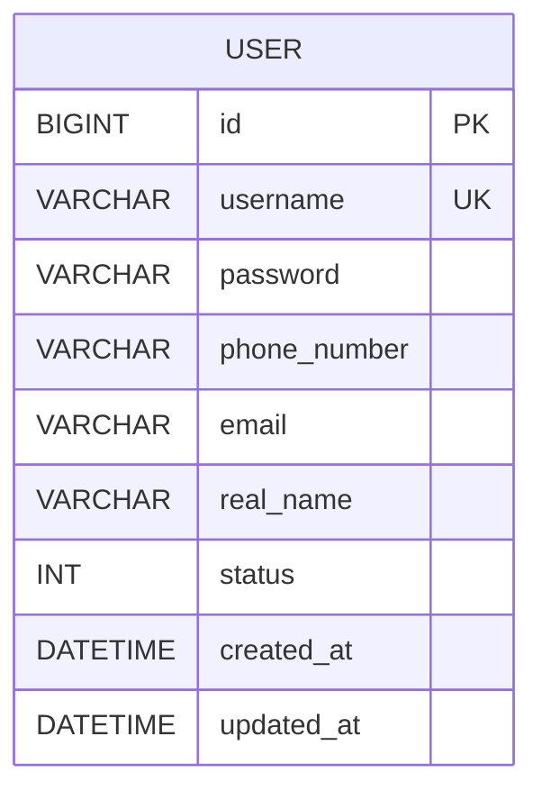
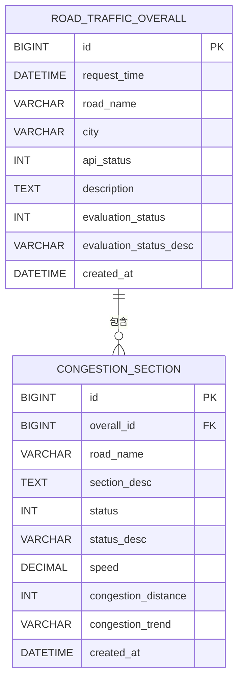
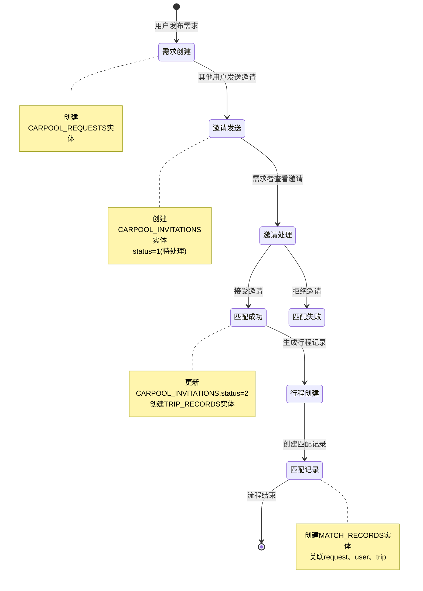

# 第四章 概念设计

## 4.1 实体识别

### 4.1.1 实体定义

通过对系统需求的分析,识别出以下主要实体:

**用户管理领域**:
1. **用户(User)**:系统使用者,包括发布拼车需求的用户和发送邀请的用户

**交通监测领域**:
2. **道路路况(RoadTraffic)**:道路的整体交通状况信息
3. **拥堵路段(CongestionSection)**:道路上具体的拥堵路段详情

**拼车服务领域**:
4. **拼车需求(CarpoolRequest)**:用户发布的拼车出行需求
5. **拼车邀请(CarpoolInvitation)**:用户之间发送的拼车邀请记录
6. **行程记录(TripRecord)**:匹配成功后生成的实际出行行程
7. **匹配记录(MatchRecord)**:需求与行程之间的匹配关系

### 4.1.2 实体描述

#### 4.1.2.1 用户(User)

**实体描述**:注册使用系统的用户,存储用户的基本信息和认证信息。

**关键属性**:
- 用户标识(id)
- 用户名(username)
- 密码(password)
- 手机号(phone_number)
- 邮箱(email)
- 真实姓名(real_name)
- 账号状态(status)

**业务规则**:
- 用户名全局唯一
- 密码使用BCrypt加密存储
- 手机号和邮箱可选,但需格式验证

#### 4.1.2.2 道路路况(RoadTraffic)

**实体描述**:某条道路在某个时间点的整体交通状况概览信息。

**关键属性**:
- 路况ID(id)
- 道路名称(road_name)
- 所在城市(city)
- 请求时间(request_time)
- API状态码(api_status)
- 路况描述(description)
- 拥堵等级(evaluation_status)
- 拥堵等级描述(evaluation_status_desc)

**业务规则**:
- 同一条道路在不同时间会生成多条记录
- 拥堵等级:0-未知,1-畅通,2-缓行,3-拥堵,4-严重拥堵

#### 4.1.2.3 拥堵路段(CongestionSection)

**实体描述**:道路具体的拥堵路段信息,一条道路可能包含多个拥堵路段。

**关键属性**:
- 路段ID(id)
- 关联路况ID(overall_id)
- 路段描述(section_desc)
- 路段状态(status)
- 平均速度(speed)
- 拥堵距离(congestion_distance)
- 拥堵趋势(congestion_trend)

**业务规则**:
- 必须关联到一个具体的路况记录
- 一个路况记录可以有0个或多个拥堵路段

#### 4.1.2.4 拼车需求(CarpoolRequest)

**实体描述**:用户发布的拼车出行需求信息。

**关键属性**:
- 需求ID(id)
- 发布用户ID(user_id)
- 是否有车(has_car)
- 乘客人数(passenger_count)
- 最大乘客数(max_passenger_count)
- 起点位置(start_location)
- 起点坐标(start_latitude, start_longitude)
- 终点位置(end_location)
- 终点坐标(end_latitude, end_longitude)
- 最早出发时间(earliest_departure_time)
- 最晚出发时间(latest_departure_time)
- 联系电话(phone_number)
- 需求状态(status_desc)

**业务规则**:
- 一个需求只能由一个用户发布
- 乘客人数不能超过最大乘客数
- 出发时间范围需合法(最早<最晚)

#### 4.1.2.5 拼车邀请(CarpoolInvitation)

**实体描述**:用户向拼车需求发送的邀请记录。

**关键属性**:
- 邀请ID(id)
- 邀请者ID(inviter_id)
- 关联需求ID(carpool_request_id)
- 乘客人数(passenger_count)
- 留言(message)
- 邀请状态(status)

**业务规则**:
- 一个用户可以向同一个需求发送多次邀请(但实际业务中应该限制)
- 邀请状态:1-待处理,2-已接受,3-已拒绝,4-已取消
- 只有需求发布者可以处理邀请

#### 4.1.2.6 行程记录(TripRecord)

**实体描述**:拼车匹配成功后生成的实际出行行程。

**关键属性**:
- 行程ID(id)
- 起点位置(start_location)
- 起点坐标(start_latitude, start_longitude)
- 终点位置(end_location)
- 终点坐标(end_latitude, end_longitude)
- 出发时间(departure_at)
- 到达时间(arrival_at)
- 行程状态(status_desc)
- 乘客总数(passenger_count)
- 匹配时间(match_at)

**业务规则**:
- 一个行程由多个拼车需求匹配生成
- 行程状态包括:待出发、进行中、已完成、已取消

#### 4.1.2.7 匹配记录(MatchRecord)

**实体描述**:记录拼车需求与行程之间的匹配关系。

**关键属性**:
- 匹配ID(id)
- 需求ID(request_id)
- 用户ID(user_id)
- 行程ID(trip_id)

**业务规则**:
- 一个需求对应一个匹配记录
- 用于追溯某个用户参与了哪个行程

## 4.2 实体属性及局部E-R图

### 4.2.1 用户实体

**属性说明**:
- **id**:主键,自增
- **username**:登录用户名,全局唯一索引
- **password**:BCrypt加密后的密码
- **phone_number**:手机号,用于联系和验证
- **email**:邮箱地址
- **real_name**:真实姓名
- **status**:账号状态,1-正常,0-禁用
- **created_at**:创建时间,自动生成
- **updated_at**:更新时间,自动更新

### 4.2.2 交通监测实体

**属性说明**:

**ROAD_TRAFFIC_OVERALL**:
- **evaluation_status**:拥堵等级,0-4
- **evaluation_status_desc**:拥堵描述,"畅通"/"缓行"/"拥堵"/"严重拥堵"

**CONGESTION_SECTION**:
- **overall_id**:外键,关联road_traffic_overall表的id
- **speed**:平均速度,单位km/h
- **congestion_distance**:拥堵距离,单位米
- **congestion_trend**:趋势,"持平"/"缓解"/"加重"

### 4.2.3 拼车服务实体

```mermaid
erDiagram
    CARPOOL_REQUEST {
        BIGINT id PK
        BIGINT user_id FK
        BOOLEAN has_car
        INT passenger_count
        INT max_passenger_count
        VARCHAR start_location
        DECIMAL start_latitude
        DECIMAL start_longitude
        VARCHAR end_location
        DECIMAL end_latitude
        DECIMAL end_longitude
        DATETIME earliest_departure_time
        DATETIME latest_departure_time
        VARCHAR phone_number
        VARCHAR status_desc
        DATETIME created_at
    }

    CARPOOL_INVITATION {
        BIGINT id PK
        BIGINT inviter_id FK
        BIGINT carpool_request_id FK
        INT passenger_count
        VARCHAR message
        INT status
        DATETIME created_at
        DATETIME updated_at
    }

    TRIP_RECORD {
        BIGINT id PK
        VARCHAR start_location
        DECIMAL start_latitude
        DECIMAL start_longitude
        VARCHAR end_location
        DECIMAL end_latitude
        DECIMAL end_longitude
        DATETIME departure_at
        DATETIME arrival_at
        VARCHAR status_desc
        INT passenger_count
        DATETIME match_at
        DATETIME created_at
    }

    MATCH_RECORD {
        BIGINT id PK
        BIGINT request_id FK
        BIGINT user_id FK
        BIGINT trip_id FK
        DATETIME created_at
    }

    CARPOOL_REQUEST ||--o{ CARPOOL_INVITATION : "收到"
    CARPOOL_REQUEST ||--o| MATCH_RECORD : "匹配"
    TRIP_RECORD ||--o{ MATCH_RECORD : "包含"
```

**属性说明**:

**CARPOOL_REQUEST**:
- **has_car**:是否有车,true/false
- **passenger_count**:当前乘客人数(包括发布者)
- **max_passenger_count**:车辆最大载客量
- **status_desc**:需求状态,"等待匹配"/"已匹配"/"已取消"

**CARPOOL_INVITATION**:
- **inviter_id**:外键,关联users表的id(邀请者)
- **carpool_request_id**:外键,关联carpool_request表的id
- **status**:邀请状态,1-待处理,2-已接受,3-已拒绝,4-已取消

**TRIP_RECORD**:
- **passenger_count**:行程总乘客数(所有参与者之和)
- **match_at**:匹配生成时间

**MATCH_RECORD**:
- **request_id**:外键,关联carpool_request表的id
- **user_id**:外键,关联users表的id
- **trip_id**:外键,关联trip_record表的id

### 4.2.4 实体间关系说明

**用户与拼车需求**:
- 关系类型:1:N
- 描述:一个用户可以发布多个拼车需求
- 外键:carpool_request.user_id → user.id

**用户与拼车邀请**:
- 关系类型:1:N
- 描述:一个用户可以发送多个拼车邀请
- 外键:carpool_invitation.inviter_id → user.id

**拼车需求与拼车邀请**:
- 关系类型:1:N
- 描述:一个拼车需求可以收到多个邀请
- 外键:carpool_invitation.carpool_request_id → carpool_request.id

**拼车需求与匹配记录**:
- 关系类型:1:1
- 描述:一个拼车需求匹配成功后生成一个匹配记录
- 外键:match_record.request_id → carpool_request.id

**行程记录与匹配记录**:
- 关系类型:1:N
- 描述:一个行程包含多个用户的匹配记录
- 外键:match_record.trip_id → trip_record.id

**道路路况与拥堵路段**:
- 关系类型:1:N
- 描述:一条道路的路况包含多个拥堵路段
- 外键:congestion_section.overall_id → road_traffic_overall.id

## 4.3 全局E-R图

### 4.3.1 完整系统E-R图

```mermaid
erDiagram
    USERS ||--o{ CARPOOL_REQUESTS : "发布"
    USERS ||--o{ CARPOOL_INVITATIONS : "发送"
    USERS ||--o{ MATCH_RECORDS : "参与"
    CARPOOL_REQUESTS ||--o{ CARPOOL_INVITATIONS : "收到"
    CARPOOL_REQUESTS ||--o| MATCH_RECORDS : "匹配到"
    TRIP_RECORDS ||--o{ MATCH_RECORDS : "包含"
    ROAD_TRAFFIC_OVERALL ||--o{ CONGESTION_SECTIONS : "包含"

    USERS {
        BIGINT id PK
        VARCHAR username UK
        VARCHAR password
        VARCHAR phone_number
        VARCHAR email
        VARCHAR real_name
        INT status
        DATETIME created_at
        DATETIME updated_at
    }

    CARPOOL_REQUESTS {
        BIGINT id PK
        BIGINT user_id FK
        BOOLEAN has_car
        INT passenger_count
        INT max_passenger_count
        VARCHAR start_location
        DECIMAL start_latitude
        DECIMAL start_longitude
        VARCHAR end_location
        DECIMAL end_latitude
        DECIMAL end_longitude
        DATETIME earliest_departure_time
        DATETIME latest_departure_time
        VARCHAR phone_number
        VARCHAR status_desc
        DATETIME created_at
    }

    CARPOOL_INVITATIONS {
        BIGINT id PK
        BIGINT inviter_id FK
        BIGINT carpool_request_id FK
        INT passenger_count
        VARCHAR message
        INT status
        DATETIME created_at
        DATETIME updated_at
    }

    TRIP_RECORDS {
        BIGINT id PK
        VARCHAR start_location
        DECIMAL start_latitude
        DECIMAL start_longitude
        VARCHAR end_location
        DECIMAL end_latitude
        DECIMAL end_longitude
        DATETIME departure_at
        DATETIME arrival_at
        VARCHAR status_desc
        INT passenger_count
        DATETIME match_at
        DATETIME created_at
    }

    MATCH_RECORDS {
        BIGINT id PK
        BIGINT request_id FK
        BIGINT user_id FK
        BIGINT trip_id FK
        DATETIME created_at
    }

    ROAD_TRAFFIC_OVERALL {
        BIGINT id PK
        DATETIME request_time
        VARCHAR road_name
        VARCHAR city
        INT api_status
        TEXT description
        INT evaluation_status
        VARCHAR evaluation_status_desc
        DATETIME created_at
    }

    CONGESTION_SECTIONS {
        BIGINT id PK
        BIGINT overall_id FK
        VARCHAR road_name
        TEXT section_desc
        INT status
        VARCHAR status_desc
        DECIMAL speed
        INT congestion_distance
        VARCHAR congestion_trend
        DATETIME created_at
    }
```

### 4.3.2 E-R图设计说明

**关系基数说明**:

1. **1:1关系**(一对一):
   - CARPOOL_REQUESTS ↔ MATCH_RECORDS: 一个拼车需求最多匹配一个行程

2. **1:N关系**(一对多):
   - USERS ↔ CARPOOL_REQUESTS: 一个用户发布多个需求
   - USERS ↔ CARPOOL_INVITATIONS: 一个用户发送多个邀请
   - USERS ↔ MATCH_RECORDS: 一个用户参与多个行程
   - CARPOOL_REQUESTS ↔ CARPOOL_INVITATIONS: 一个需求收到多个邀请
   - TRIP_RECORDS ↔ MATCH_RECORDS: 一个行程包含多个参与者
   - ROAD_TRAFFIC_OVERALL ↔ CONGESTION_SECTIONS: 一个路况包含多个路段

**设计考虑**:

1. **规范化设计**:
   - 消除部分依赖:达到第二范式(2NF)
   - 消除传递依赖:达到第三范式(3NF)
   - 避免数据冗余和更新异常

2. **性能优化**:
   - 合理使用外键索引
   - 预留扩展字段
   - 时间字段自动管理

3. **扩展性**:
   - 实体设计考虑未来功能扩展
   - 状态字段使用描述性字符串,便于扩展新状态
   - 坐标字段支持地图功能扩展

4. **完整性约束**:
   - 主键约束:确保实体唯一性
   - 外键约束:确保参照完整性
   - 非空约束:确保必要字段有值
   - 唯一约束:防止重复数据

### 4.3.3 E-R图与业务流程对应

**拼车完整流程的实体变化**:

通过以上概念设计,明确了系统的实体结构、属性特征和相互关系,为后续的逻辑设计和物理设计奠定了基础。E-R图直观地展示了系统的数据模型,便于开发团队理解和实现。
